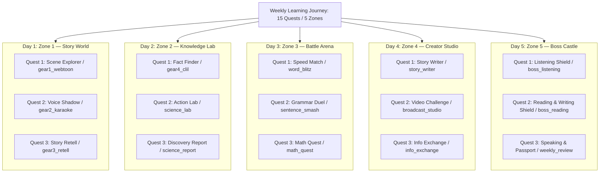

# 🏛️ ENGQUEST3K — MASTER CURRICULUM & SYSTEM ARCHITECTURE (W01–W156)

**Document Reference**: `docs/MASTER_ARCHITECTURE_W01_W156.md`  
**Version**: 2.2.0 (Unified 15 Quests / 5 Zones + Lite Mode W01–W16, Multi-Level Assessment & 28-Mock Test Cadence)  
**Governing Standard**: Cambridge CEFR (Pre-A1 to B1+) & Academic Reading as a Medium of Instruction Standard  
**Effective Date**: 2026-09-05  
**Status**: 🟢 **CANONICAL MASTER ARCHITECTURE**

---

## 1. Executive Summary & Dual North Star Objectives

EngQuest3K is a 3-year, 156-week integrated educational platform designed to transform primary and lower-secondary students from basic English beginners into confident academic readers and structured thinkers capable of independently processing academic texts and presenting well-organized opinions in English.

```
       [ W01 – W16 ] Pre-A1 Starters — LITE MODE (10 Quests/tuần, Phonics, Visual Anchors)
            │         └── 1 Mock Test at W16 (Starters Shield Festival)
            │
       [ W17 – W32 ] A1 Movers (Sentence Builders, Notepad Dictation, 4-Pic Sequence)
            │         └── 2 Mock Tests at W24 (Mid-Movers) & W32 (Final Movers)
            │
       [ W33 – W72 ] A2 Flyers ★ NORTH STAR 1: 15/15 Shields Cambridge Flyers
            │         └── Strict 4+1 Rotary Cycle (8 Full Mock Tests)
            │
       [ W73 – W112] LEVEL 1 HẬU FLYERS: Cambridge B1 Preliminary (PET) & CLIL STEM
            │         └── Strict 4+1 Cycle (8 Full Mock Tests & CER Science Practical)
            │
       [ W113 – W156] LEVEL 2 HẬU FLYERS: B1+ Strong Academic Reading & Structured Opinion
                      ★ NORTH STAR 2: Academic English Proficiency & Independent Study Readiness
                      └── Strict 4+1 Cycle (9 Full Mock Tests & Capstone Graduation)
```

### 🎯 North Star 1 (Milestone at Week 72): Cambridge A2 Flyers 15/15 Shields
- Complete mastery of all 16 authentic Cambridge Young Learners A2 Flyers exam mechanics.
- **Listening (5 Parts)**: Two-play loop standard, SVG line matching, notepad note-taking, card matching A–H, 3-picture MCQ, color & write.
- **Reading & Writing (7 Parts)**: 15-word bank matching, 5-turn dialogue A–H, story cloze with title, 10-item grammar inline dropdowns, text extraction (1–4 words), open cloze, 3-picture narrative writing ($\ge 20$ words).
- **Speaking (4 Parts)**: Spot-the-differences, 2-way information exchange cue cards, 5-panel story continuation, examiner personal interview.
- **Target**: 100% of students attain 15/15 Cambridge Shields upon completing Week 72.

### 🎯 North Star 2 (Culmination at Week 156): B1+ Strong Academic Reading & Structured Opinion Presentation
- Confident independent reading of grade-appropriate expository texts (~500–800 words) across Science, Social Studies, History, and basic Economics.
- Structured language production using the **CER (Claim - Evidence - Reasoning)** scientific framework.
- Opinion essay writing (~140–190 words) with clear Thesis Statement, Supporting Arguments, and Conclusion.
- Recorded opinion presentations (3–5 minutes) on prepared topics with visual aids.
- Extended Project Report (~500–800 words) demonstrating research and synthesis skills.
- **Cambridge B1 Preliminary (PET) Pass with Merit** as the measurable certification target.

---

## 2. The Master Invariant: 15 Quests / 5 Zones Architecture (with Lite Mode Exception)

Every single week from **W17 to W156** operates on a strict **15 Quests distributed evenly across 5 Zones (1 Day = 1 Zone, exactly 3 Quests per Day)**. This completely replaces legacy fragmented "stations".

$$\mathbf{1 \; WEEK} = \mathbf{5 \; DAYS} = \mathbf{5 \; ZONES} = \mathbf{15 \; QUESTS}$$

> **⚠️ LITE MODE EXCEPTION (W01–W16):** Weeks 01–16 (Pre-A1 Starters, trẻ 6–7 tuổi) hoạt động ở chế độ **10 Quests / 5 Zones (2 Quests/Day)** do giới hạn attention span và cognitive load. Xem §9 để biết chi tiết 5 quests bị giản lược.



### Hai Hình Thái Tuần Học (Two Week Modalities)

1. **Tuần Luyện Tập Xoay Vòng (Rotary Practice Weeks — 80% số tuần)**:
   - **Quests 1–12 (Days 1–4)**: Học kiến thức mới, khám phá cốt truyện, thí nghiệm Action Lab, đấu trường Battle Arena, sáng tạo Creator Studio.
   - **Quests 13–15 (Day 5 — Zone 5)**: Đánh giá quá trình tập trung sâu vào **4 Cambridge Parts** xoay vòng mỗi tuần (ví dụ: W33 luyện L1, L2, R1, S1; W34 luyện L3, R2, R3, S2...). Học sinh được mài giũa kỹ lưỡng từng kỹ năng thành phần mà không bị quá tải.
2. **Tuần Thi Thử Trọn Vẹn (Full Mock Test Weeks — 20% số tuần / 28 tuần trên toàn khóa)**:
   - **Quests 1–12 (Days 1–4)**: Ôn tập tổng hợp theo chuyên đề (Review & Priming), hệ thống hóa lỗi sai thường gặp (Error Analysis), mô phỏng kỹ năng phòng thi.
   - **Quests 13–15 (Day 5 — Zone 5)**: Kích hoạt **Bài Thi Chuẩn Hóa Toàn Phần (Full Complete Examination)** với đồng hồ đếm ngược nghiêm ngặt:
     - `boss_listening`: Toàn bộ các phần Listening của cấp độ đó.
     - `boss_reading`: Toàn bộ các phần Reading & Writing của cấp độ đó.
     - `weekly_review`: Toàn bộ các phần Speaking hoặc Vấn đáp / Tranh luận trực tiếp.

---

## 3. Four Central Data Hubs Architecture

Mọi dữ liệu của mỗi tuần được lưu trữ tập trung trong **4 Data Hubs** tại `src/data/weeks/week_XX/`:

```
src/data/weeks/week_XX/
 ├── reading_hub.js       ──> Powers Zone 1 (Webtoon, Retell), Zone 2 (Fact Finder), Zone 5 (Reading Shield R1–R6 / PET Reading)
 ├── listening_hub.js     ──> Powers Zone 2 (Action Lab), Zone 3 (Speed Match, Grammar Duel, Math Quest), Zone 5 (Listening Shield L1–L5 / PET Listening)
 ├── writing_hub.js       ──> Powers Zone 4 (Story Writer), Zone 5 (Reading & Writing Shield R7 / PET Writing / Argumentative Essay)
 └── speaking_hub.js      ──> Powers Zone 4 (Video Challenge, Info Exchange), Zone 5 (Speaking & Passport S1–S4 / PET Speaking / Debate)
```

---

## 4. Hệ thống Khảo thí Đa Cấp độ ở Zone 5 (Day 5: Boss Castle)

Sau khi hoàn thành mục tiêu 15 Khiên Flyers ở Tuần 72, Zone 5 được nâng cấp qua **2 Cấp độ Khảo thí Quốc tế Cao cấp**:

```mermaid
graph LR
    subgraph Gen1 ["Thế Hệ 1: Cambridge Young Learners W01-72"]
        Starters["Pre-A1 Starters: Nhận diện & Từ đơn"]
        Movers["A1 Movers: Điền Notepad & 4 Tranh"]
        Flyers["A2 Flyers: 16 Parts & 15 Khiên"]
    end

    subgraph Gen2 ["Thế Hệ 2: B1 Preliminary & CLIL Lab W73-112"]
        PET_L["PET Listening 4 Parts"]
        PET_RW["PET Reading 6 Parts + Writing 100w"]
        PET_S["PET Speaking 4 Parts + CLIL Viva Voce"]
    end

    subgraph Gen3 ["Thế Hệ 3: B1+ Academic Reading & Opinion W113-156"]
        Acad_Read["Academic Reading 500-800w Passages"]
        Opinion_Write["Opinion Essay 140-190w + Extended Report"]
        Struct_Present["Structured Opinion Presentation + Project Report"]
    end

    Gen1 --> Gen2 --> Gen3
```



### Bảng Tiến Hóa Định Dạng Khảo Thí Zone 5 theo 3 Thế Hệ

| Đặc tả Khảo thí | Thế hệ 1: Young Learners (W01–W72) | Thế hệ 2: B1 Preliminary & CLIL (W73–W112) | Thế hệ 3: B1+ Academic Reading & Opinion (W113–W156) |
| :--- | :--- | :--- | :--- |
| **Độ tuổi Mục tiêu** | 6 – 10 tuổi (Tiểu học) | 10 – 12 tuổi (Cuối tiểu học & Lớp 6–7) | 12 – 14 tuổi (Lớp 7, 8, 9) |
| **Mục tiêu Khảo thí** | 15/15 Khiên Starters, Movers, Flyers | Chứng chỉ Cambridge B1 PET (Merit/Distinction) $\approx$ IELTS 4.5–5.5 | B1+ Strong Academic Reading & Structured Opinion $\approx$ IELTS 5.0–5.5 & Independent Study Readiness |
| **Định dạng Listening** (`boss_listening`) | 5 Parts thiếu nhi (vẽ đường nối, ghi số/tên notepad, nối tranh, trắc nghiệm 3 tranh, tô màu) | 4 Parts B1 PET (7 hội thoại ngắn, điền form thông báo, phỏng vấn độc thoại dài, đối thoại quan điểm) | 4 Parts B1+ Academic (nghe bài giảng khoa học trích xuất dữ liệu, note-taking bài podcast học thuật, hội thoại chuyên đề dài) |
| **Định dạng Reading** (`boss_reading`) | 6 Parts (định nghĩa từ vựng, hội thoại A-H, đục lỗ truyện, dropdown ngữ pháp, trích xuất tóm tắt, open cloze) | 6 Parts Reading B1 (biển báo thực tế, ghép người-văn bản, bài đọc dài, gapped text điền câu, trắc nghiệm từ, open cloze) | 6 Parts B1+ Academic (đọc bài văn giải thích 500–800 từ, trích xuất luận điểm chính, tóm tắt đoạn, inference questions, gapped text học thuật, open cloze nâng cao) |
| **Định dạng Writing** (`boss_reading`) | Part 7: Viết truyện theo 3 tranh liên hoàn ($\ge 20$ từ) | Part 1: Viết email phản hồi ($\ge 100$ từ); Part 2: Viết bài văn/bài báo theo chủ đề ($\ge 100$ từ) | Viết bài luận quan điểm (Opinion Essay $\ge 140–190$ từ) với Thesis, luận cứ & kết luận; Extended Project Report ($\ge 500$ từ) |
| **Định dạng Speaking** (`weekly_review`) | 4 Parts (tìm điểm khác, hỏi đáp cue cards, kể tiếp câu chuyện tranh, phỏng vấn cá nhân) | 4 Parts PET (hỏi đáp cá nhân, miêu tả tranh chi tiết, thảo luận tình huống, thảo luận mở rộng) + CLIL CER Viva Voce | Thuyết trình quan điểm có chuẩn bị (Structured Opinion Presentation 3–5 phút) + Ghi hình Extended Project Report + Phỏng vấn học thuật (Academic Interview Q&A) |
| **Thang điểm & Vinh danh** | **Hệ thống 15 Khiên Cambridge** (Max 5 Nghe, 5 Đọc & Viết, 5 Nói) | **Cambridge English Scale (140–160)** + Báo cáo Khoa học CER 4 Tiêu chí | **B1+ Academic Proficiency Scale** + Extended Project Portfolio Grade (A/B/C/D) + Presentation Rubric Score |

---

## 5. Bản đồ Chu kỳ 28 Tuần Mock Test trên Toàn Khóa (156 Tuần)

Chu kỳ Mock Test được thiết kế tối ưu theo tâm sinh lý lứa tuổi: **Giãn cách ở giai đoạn đầu để xây dựng sự tự tin $\rightarrow$ Tăng tốc chu kỳ 4+1 ở các giai đoạn sau để rèn luyện sức bền phòng thi**.

```
┌─────────────────────────────────────────────────────────────────────────────────────────────┐
│                            BẢNG PHÂN BỔ 28 TUẦN FULL MOCK TEST TOÀN DIỆN                    │
├───────────────┬──────────────┬────────────────────────┬─────────────────────────────────────┤
│ Giai đoạn     │ Trình độ     │ Số lượng Mock Test     │ Vị trí Tuần Thi Thử (Full Mock)     │
├───────────────┼──────────────┼────────────────────────┼─────────────────────────────────────┤
│ W01 – W16     │ Pre-A1       │ 1 Mock Test Duy nhất   │ W16 (Starters Graduation Shield)    │
│               │ (LITE MODE)  │                        │                                     │
├───────────────┼──────────────┼────────────────────────┼─────────────────────────────────────┤
│ W17 – W32     │ A1 Movers    │ 2 Mock Tests           │ W24 (Mid-Movers), W32 (Final Movers)│
├───────────────┼──────────────┼────────────────────────┼─────────────────────────────────────┤
│ W33 – W72     │ A2 Flyers    │ 8 Mock Tests (Nhịp 4+1)│ W37, W42, W47, W52, W57, W62, W67,  │
│               │              │                        │ W72 (Official Flyers Gate)          │
├───────────────┼──────────────┼────────────────────────┼─────────────────────────────────────┤
│ W73 – W112    │ B1 PET       │ 8 Mock Tests (Nhịp 4+1)│ W77, W82, W87, W92, W97, W102, W107,│
│               │ & CLIL Lab   │                        │ W112 (B1 PET Official Gate)         │
├───────────────┼──────────────┼────────────────────────┼─────────────────────────────────────┤
│ W113 – W156   │ B1+ Academic │ 9 Mock Tests (Nhịp 4+1)│ W117, W122, W127, W132, W137, W142, │
│               │ Reading      │                        │ W147, W152, W156 (Final Capstone)   │
└───────────────┴──────────────┴────────────────────────┴─────────────────────────────────────┘
```

### Chi tiết 28 Mốc Khảo Thí:

1. **W16**: `★ Starters Graduation Mock` — Ngày hội nhận Khiên Starters đầu tiên cho học sinh 6–7 tuổi. *(Lite Mode: 10 quests)*
2. **W24**: `★ Movers Mid-Way Mock 1` — Đo lường tiến độ giữa kỳ, rà soát lỗi chính tả Notepad Part 2.
3. **W32**: `★ Movers Final Mock 2` — Khảo sát toàn diện cấp Chứng chỉ Movers trước khi bước vào Flyers.
4. **W37, W42, W47, W52, W57, W62, W67**: Các kỳ `★ Flyers Full Mock Test` chu kỳ 5 tuần (4 tuần luyện 4 parts xoay vòng + 1 tuần gộp trọn bộ 16 parts có bấm giờ).
5. **W72**: `★ CAMBRIDGE FLYERS OFFICIAL GATE` — Kỳ thi chính thức chốt mục tiêu **15/15 Khiên Flyers**.
6. **W77, W82, W87, W92, W97, W102, W107**: Các kỳ `★ B1 PET & CLIL Lab Mock` chu kỳ 5 tuần.
7. **W112**: `★ CAMBRIDGE B1 PET OFFICIAL GATE` — Kỳ thi chính thức chốt chuẩn **B1 Preliminary with Merit/Distinction**.
8. **W117, W122, W127, W132, W137, W142, W147, W152**: Các kỳ `★ B1+ Academic Reading & Opinion Assessment Mock`.
9. **W156**: `★ 3-YEAR CAPSTONE GRADUATION & EXTENDED PROJECT SHOWCASE` — Trình bày Extended Project Report, nộp Portfolio 3 năm và hoàn thành chuẩn **B1+ Academic Reading Proficiency**.

---

## 6. Universal 3-Level Scaffolding Matrix across Productive Tasks

Mọi bài tập sáng tạo (`story_writer`, `discovery_report`, `broadcast_studio`, `info_exchange`, `gear3_retell`) đều tích hợp giàn giáo 3 cấp độ:

```
[ Level 1: Full Scaffolding ]  ──>  [ Level 2: Guided Chunks ]  ──>  [ Level 3: Autonomous ]
  (100% Model + 1-Tap Pills)         (Collocation Sense Units)         (Criteria & Outline)
```

| Task / Quest | Level 1: Full Scaffolding (Novice / Starters) | Level 2: Guided Chunks (Intermediate / Movers-Flyers) | Level 3: Autonomous (Advanced / CLIL B1-B2) |
| :--- | :--- | :--- | :--- |
| **`story_retell`** (`gear3_retell`) | **Full Model**: Hiển thị 100% câu mẫu chuẩn kèm nút nghe audio. | **Linear Thinking ESL Chunks**: Hiển thị cụm từ Collocations trong ngoặc: `Jake was [walking carefully] down the [school corridor].` | **Keyword Outline**: Chỉ cung cấp danh từ và động từ chính: `Jake / walk / wet floor / slip / help`. |
| **`discovery_report`** (`science_report`) | **1-Tap Word Pills**: Điền từ qua các thẻ từ có sẵn, không phải gõ phím. | **Sentence Starters + Data Card**: `The data proves that... because...` dựa trên bảng số liệu. | **Full CER Canvas**: Khung luận điểm Claim, Evidence, Reasoning kèm ngân hàng từ nối học thuật. |
| **`story_writer`** (`story_writer`) | **Guided Cloze Frame**: 3 tranh có sẵn câu khung và từ gợi ý. | **Collocation Keyword Bank**: 4–5 thẻ cụm từ per tranh (`slipped heavily`, `first-aid kit`). | **Open Composition**: Viết tự do 3 tranh với bộ đếm từ ($\ge 20$ hoặc $\ge 100$ từ) và Rubric chấm điểm. |
| **`broadcast_studio`** (`broadcast_studio`) | **Full Teleprompter**: Kịch bản chạy chữ tự động theo nhịp đọc. | **Chunk-Segmented Prompter**: Đánh dấu nhịp ngắt nghỉ tự nhiên bằng ký hiệu `//`. | **Speaker Cue Cards**: Thẻ ghi chú luận điểm chính và đồng hồ bấm giờ thuyết trình. |
| **`info_exchange`** (`info_exchange`) | **Direct Question Prompts**: Câu hỏi mẫu đầy đủ kèm audio hướng dẫn. | **Question Scaffolding Stems**: Gợi ý từ khóa để tự đặt câu (`Where / school?` $\rightarrow$ `Where is the school?`). | **Raw Cue Card**: Thẻ thông tin gốc chỉ có tên trường dữ liệu; học sinh tự đặt và trả lời câu hỏi 100%. |

---

## 7. The Dictation 3-Step Engine

Quy trình chép chính tả 3 bước bắt buộc cho Cambridge Listening Part 2 và hội thoại hàng ngày:
1. **Bước 1: Authentic Two-Play Listening**: Nghe Play 1 $\rightarrow$ nghỉ 3 giây $\rightarrow$ Play 2 $\rightarrow$ gõ thông tin vào Notepad mà không có gợi ý chữ.
2. **Bước 2: Visual Diff Verification**: Hệ thống so khớp ký tự màu sắc phát hiện ngay lỗi chính tả (Xanh = Đúng, Đỏ = Sai ký tự/thiếu chữ).
3. **Bước 3: Listen & Shadow Loop**: Nghe câu mẫu chuẩn và ghi âm nhại lại (Shadowing) để hoàn thiện nhịp điệu và ngữ điệu.

---

## 8. Ba Tầng Kiểm Thử Tự Động (3-Tier Automated Gates)

Mọi tuần học mới bắt buộc phải vượt qua 3 cổng kiểm thử trước khi đóng băng:
1. **Tier 1: CEFR Curriculum Guard (`npm run audit:cefr <N>`)**: 0 lỗi vượt cấp từ vựng, độ dài câu $\le 24$ từ (truyện) hoặc $\le 28$ từ (khoa học CLIL).
2. **Tier 2: Task Purity & Completeness Audit (`node scripts/audit_all_w33_tasks.mjs`)**: 15/15 Quests pass (hoặc 10/10 cho Lite Mode W01–W16), 0 fallback tĩnh, 0 màn hình trắng.
3. **Tier 3: Mechanic Fidelity Doctrine & Content Quality (`node scripts/gate17_fidelity_doctrine.mjs <N>` & `gate16`)**: 100% pass schema và các bất biến khảo thí quốc tế.

---

## 9. Lite Mode Architecture (W01–W16: Pre-A1 Starters)

Trẻ 6–7 tuổi (Pre-A1) có attention span giới hạn 12–18 phút liên tục. Do đó, giai đoạn W01–W16 hoạt động ở chế độ **Lite Mode: 10 Quests / 5 Zones (2 Quests/Day)**.

### 10-Quest Mapping (Lite Mode)

```
LITE MODE WEEKLY STRUCTURE (10 TASKS / 5 DAYS):
├── DAY 1: Zone 1 — Story World (2 Quests)
│    ├── Quest 1: gear1_webtoon      ──> Scene Explorer (Interactive comic)
│    └── Quest 2: gear2_karaoke      ──> Voice Shadow (Listen & repeat songs)
│    ✗ gear3_retell SIMPLIFIED → integrated as "Say 1 sentence" in gear2_karaoke
├── DAY 2: Zone 2 — Knowledge Lab (2 Quests)
│    ├── Quest 1: gear4_clil         ──> Fact Finder (Picture vocabulary + audio)
│    └── Quest 2: science_lab        ──> Action Lab (Drag-and-drop visual experiment)
│    ✗ science_report REPLACED → "Draw & Say" (vẽ tranh + nói 1 câu đơn vào mic)
├── DAY 3: Zone 3 — Battle Arena (2 Quests)
│    ├── Quest 1: word_blitz         ──> Speed Match (Flashcard vocabulary pairing)
│    └── Quest 2: sentence_smash     ──> Word Sort (Phân loại từ vựng theo nhóm)
│    ✗ math_quest REPLACED → "Count & Match" (đếm đồ vật + nối số với hình)
├── DAY 4: Zone 4 — Creator Studio (2 Quests)
│    ├── Quest 1: story_writer       ──> Draw & Tell (vẽ 1 tranh + ghi âm 2–3 câu)
│    └── Quest 2: info_exchange      ──> Show & Tell (chỉ ảnh gia đình/lớp + nói tên)
│    ✗ broadcast_studio REPLACED → "Listen & Repeat" (nghe mẫu + ghi âm nhại)
└── DAY 5: Zone 5 — Boss Castle (2 Quests)
     ├── Quest 1: boss_listening     ──> Listening Shield (Starters L1–L3 xoay vòng)
     └── Quest 2: weekly_review      ──> Speaking & Sticker (Starters S1–S2 + dán sticker thưởng)
     ✗ boss_reading SIMPLIFIED → integrated vào boss_listening (Starters R1–R3 trắc nghiệm hình)
```

### 5 Quests bị Giản lược trong Lite Mode

| Quest Gốc (Full Mode) | Thay thế Lite Mode | Lý do Sư phạm |
|---|---|---|
| `gear3_retell` (Story Retell) | Tích hợp vào `gear2_karaoke` (nói 1 câu) | Trẻ Pre-A1 chưa thể retell cả đoạn truyện |
| `science_report` (Discovery Report) | **Draw & Say** (vẽ + nói 1 câu) | Viết câu quan sát bất khả thi ở Pre-A1 |
| `math_quest` (Math Quest Bar Model) | **Count & Match** (đếm + nối) | Bar Model SVG quá phức tạp cho 6 tuổi |
| `broadcast_studio` (Video Challenge) | **Listen & Repeat** (nghe + nhại) | Quay video thuyết trình không phù hợp Pre-A1 |
| `boss_reading` (Reading Shield) | Tích hợp vào `boss_listening` | Starters Reading dùng hình ảnh, có thể gộp |

### Transition từ Lite Mode sang Full Mode

- **W15**: Tuần chuyển tiếp — bắt đầu giới thiệu 12 quests (thêm `gear3_retell` và `math_quest` dạng đơn giản).
- **W16**: Mock Test vẫn 10 quests nhưng Zone 5 mở rộng thêm Starters Reading riêng.
- **W17**: Chuyển hoàn toàn sang **Full Mode 15 quests** khi bước vào A1 Movers.
