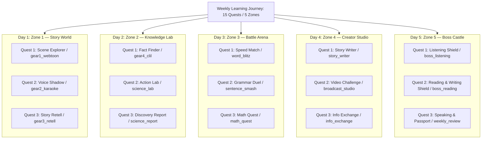
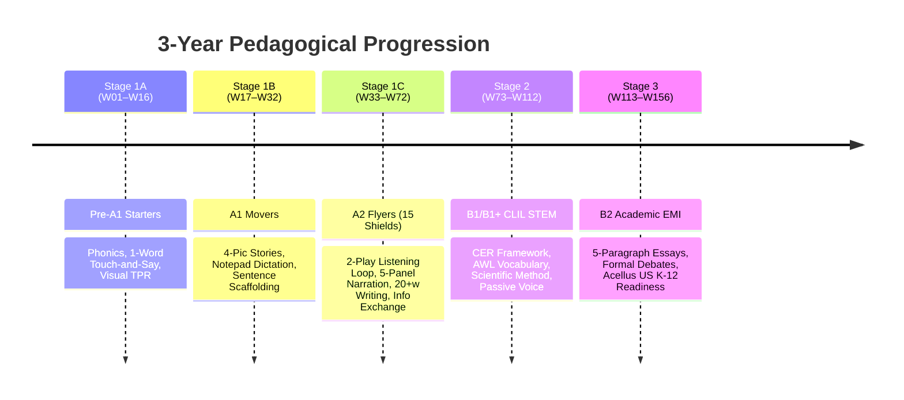
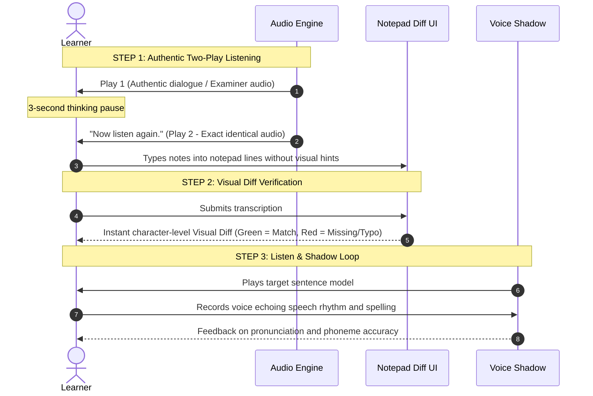

# 🏛️ ENGQUEST3K — MASTER CURRICULUM & SYSTEM ARCHITECTURE (W01–W156)

**Document Reference**: `docs/MASTER_ARCHITECTURE_W01_W156.md`  
**Version**: 2.0.0 (Unified 15 Quests / 5 Zones & 3-Year EMI Roadmap)  
**Governing Standard**: Cambridge CEFR & US K-12 EMI (English as a Medium of Instruction) Standard  
**Effective Date**: 2026-09-04  
**Status**: 🟢 **CANONICAL MASTER ARCHITECTURE**

---

## 1. Executive Summary & Dual North Star Objectives

EngQuest3K is a 3-year, 156-week integrated educational platform designed to transform primary and lower-secondary students from basic English beginners into fully autonomous academic thinkers capable of learning core school subjects directly in English.

```
       [ W01 – W16 ] Pre-A1 Starters (Phonics, Word Naming, Visual Anchors)
            │
       [ W17 – W32 ] A1 Movers (Sentence Builders, Notepad Dictation, 4-Pic Sequence)
            │
       [ W33 – W72 ] A2 Flyers ★ NORTH STAR 1: 15/15 Shields Cambridge Flyers
            │
       [ W73 – W112] B1 / B1+ CLIL STEM (CER Framework, Scientific Inquiry, AWL)
            │
       [ W113 – W156] B2 Academic EMI ★ NORTH STAR 2: US K-12 / Acellus Readiness
                     (5-Paragraph Argumentative Essay, Formal Debate, Capstone)
```

### 🎯 North Star 1 (Milestone at Week 72): Cambridge A2 Flyers 15/15 Shields
- Complete mastery of all 16 authentic Cambridge Young Learners A2 Flyers exam mechanics.
- **Listening (5 Parts)**: Two-play loop standard, SVG line matching, notepad note-taking, card matching A–H, 3-picture MCQ, color & write.
- **Reading & Writing (7 Parts)**: 15-word bank matching, 5-turn dialogue A–H, story cloze with title, 10-item grammar inline dropdowns, text extraction (1–4 words), open cloze, 3-picture narrative writing ($\ge 20$ words).
- **Speaking (4 Parts)**: Spot-the-differences, 2-way information exchange cue cards, 5-panel story continuation, examiner personal interview.
- **Target**: 100% of students attain 15/15 Cambridge Shields upon completing Week 72.

### 🎯 North Star 2 (Culmination at Week 156): Academic English as a Medium of Instruction (EMI)
- Full readiness to study mainstream international and American curricula (e.g., Acellus Academy K-12, California Wonders, Singapore Math & Science).
- Ability to independently read and synthesize specialized expository texts across Science, Social Studies, History, and Economics.
- Structured language production using the **CER (Claim - Evidence - Reasoning)** scientific framework.
- Formal argumentative writing (5-paragraph essays with Thesis Statement, Supporting Arguments, Counterargument, and Rebuttal).
- Public speaking and academic debate capability (defending motions, cross-examination, and rebuttal speeches).

---

## 2. The Master Invariant: 15 Quests / 5 Zones Architecture

Every single week from W01 to W156 operates on a strict **15 Quests distributed evenly across 5 Zones (1 Day = 1 Zone, exactly 3 Quests per Day)**. This completely replaces legacy fragmented "stations".

$$\mathbf{1 \; WEEK} = \mathbf{5 \; DAYS} = \mathbf{5 \; ZONES} = \mathbf{15 \; QUESTS}$$



### 15-Quest Master Registry Table

| Day | Zone Name | Quest Key | Learner-Facing Name | Pedagogical Objective & Interaction | Primary Component |
| :---: | :--- | :--- | :--- | :--- | :--- |
| **Day 1** | **Zone 1: Story World** | `gear1_webtoon` | **Scene Explorer** | Visual immersion, tap-to-listen dialogue, character comic panels | `StoryWorldZone.jsx` |
| **Day 1** | **Zone 1: Story World** | `gear2_karaoke` | **Voice Shadow** | Acoustic shadow, word-level karaoke sync, pitch & rhythm matching | `VoiceShadow.jsx` |
| **Day 1** | **Zone 1: Story World** | `gear3_retell` | **Story Retell** | Linear Thinking ESL collocation chunk speaking with 3 scaffolding tiers | `StoryRetell.jsx` |
| **Day 2** | **Zone 2: Knowledge Lab** | `gear4_clil` | **Fact Finder** | CLIL non-fiction article, audio glossary, concept comprehension | `FactFinder.jsx` |
| **Day 2** | **Zone 2: Knowledge Lab** | `science_lab` | **Action Lab** | Interdisciplinary experiment / simulation / cause-and-effect problem solving | `ActionLab.jsx` |
| **Day 2** | **Zone 2: Knowledge Lab** | `science_report` | **Discovery Report** | Scientific report synthesis with 1-tap word pills, observation data card | `DiscoveryReportCreator.jsx` |
| **Day 3** | **Zone 3: Battle Arena** | `word_blitz` | **Speed Match** | High-velocity vocabulary pairing under time pressure | `SpeedMatch.jsx` |
| **Day 3** | **Zone 3: Battle Arena** | `sentence_smash`| **Grammar Duel** | Sentence structure ordering, syntax battle vs AI bot | `SentenceBuilderBattle.jsx` |
| **Day 3** | **Zone 3: Battle Arena** | `math_quest` | **Math Quest** | Singapore Math C.U.B.E.S. word problem solving with Bar Model SVGs | `BarModelQuest.jsx` |
| **Day 4** | **Zone 4: Creator Studio** | `story_writer` | **Story Writer** | Creative continuous narrative writing (Cambridge Part 7 aligned) | `PictureStoryWriter.jsx` |
| **Day 4** | **Zone 4: Creator Studio** | `broadcast_studio`| **Video Challenge** | Virtual webcam podcast presentation, teleprompter, speaking recording | `BroadcastStudio.jsx` |
| **Day 4** | **Zone 4: Creator Studio** | `info_exchange` | **Info Exchange** | Interactive 2-way question asking and answering (Cambridge Speaking Part 2) | `InfoExchangeZone.jsx` |
| **Day 5** | **Zone 5: Boss Castle** | `boss_listening`| **Listening Shield** | Official Cambridge 2-play loop summative test (Parts 1–5 rotary) | `BossListeningShield.jsx` |
| **Day 5** | **Zone 5: Boss Castle** | `boss_reading` | **Reading Shield** | Official Cambridge Reading & Writing exam test (Parts 1–6 rotary) | `BossReadingShield.jsx` |
| **Day 5** | **Zone 5: Boss Castle** | `weekly_review` | **Speaking & Passport**| Examiner interview, 15-Shield passport ceremony, badge awards | `SpeakingPassportZone.jsx` |

---

## 3. Four Central Data Hubs Architecture

To eliminate legacy file fragmentation, each week's content is stored exclusively in **4 Data Hubs** in `src/data/weeks/week_XX/`:

```
src/data/weeks/week_XX/
 ├── reading_hub.js       ──> Powers Zone 1 (Webtoon, Retell), Zone 2 (Fact Finder), Zone 5 (Reading Shield R1–R6)
 ├── listening_hub.js     ──> Powers Zone 2 (Action Lab), Zone 3 (Speed Match, Grammar Duel, Math Quest), Zone 5 (Listening Shield L1–L5)
 ├── writing_hub.js       ──> Powers Zone 4 (Story Writer), Zone 5 (Reading & Writing Shield R7)
 └── speaking_hub.js      ──> Powers Zone 4 (Video Challenge, Info Exchange), Zone 5 (Speaking & Passport S1–S4)
```

### Data Flow Invariants:
1. **Single Source of Truth**: All Cambridge assessment parts and learning scaffolds draw directly from the 4 hubs without duplicating data objects.
2. **Zero Hardcoded Strings**: All UI labels, prompt cues, and word banks are fed dynamically from the Hubs.
3. **Fail-Loud Safety**: If an expected data key is missing, components must render an explicit error banner rather than displaying silent dummy text.

---

## 4. Evolutionary Calibration Across the 5 Stages

The curriculum evolves seamlessly across 5 distinct developmental stages, matching children's cognitive and linguistic growth:



### Detailed Stage Breakdown

#### 1. Stage 1A: Pre-A1 Starters (Weeks 01–16)
- **Learner Profile**: Young learners (Ages 6–7), emergent readers.
- **Language Focus**: Letter-sound correspondence (Phonics), basic sight words, simple naming, colors, numbers 1–20, classroom commands.
- **Pedagogical Adaptation in 15 Quests**:
  - `gear1_webtoon`: High visual ratio, 1–2 short sentences per panel.
  - `gear2_karaoke`: Slow acoustic pacing (0.75x speed), clear syllable enunciation.
  - `gear3_retell`: Touch-to-speak single words and 2-word noun phrases.
  - `science_lab`: Sensory observation (hot/cold, sinking/floating, colors mixing).
  - `math_quest`: Single-digit counting, concrete picture bar models.
  - `story_writer`: Fill-in-the-blank with 1-tap word choices; tracing and letter assembly.
  - `boss_listening`: Starters listening mechanics (identify objects, draw lines to colors).

#### 2. Stage 1B: A1 Movers (Weeks 17–32)
- **Learner Profile**: Primary students (Ages 7–8) gaining sentence-level confidence.
- **Language Focus**: Present Simple vs Continuous, past of *to be* (was/were), basic adjectives and prepositions, everyday routines.
- **Pedagogical Adaptation in 15 Quests**:
  - `gear3_retell`: 50% Sentence starter scaffolding (`Jake was walking...`).
  - `science_report`: Simple 2-sentence discovery reports using guided word pills.
  - `math_quest`: 2-digit addition/subtraction, part-whole bar models with C.U.B.E.S.
  - `info_exchange`: 1-way questioning practice with explicit question stems (`Where is...?`, `How old is...?`).
  - `story_writer`: 3-picture sequencing, writing 1 sentence per picture (10–15 words).
  - `boss_listening`: Movers Part 2 notepad note-taking (spelling names, recording single numbers).

#### 3. Stage 1C: A2 Flyers — Golden Master (Weeks 33–72)
- **Learner Profile**: Upper primary (Ages 8–10), fluent paragraph readers.
- **Language Focus**: Past Simple regular and irregular verbs, Past Continuous, comparatives/superlatives, modals (*should, must, could*), future with *going to*.
- **Pedagogical Invariant**: Strict compliance with `schemas/cambridge-flyers-fidelity-doctrine.schema.json` and 16 Cambridge Exam Parts.
- **Pedagogical Adaptation in 15 Quests**:
  - `gear2_karaoke`: Natural speech rate (1.0x), linking sounds and intonation contours.
  - `gear3_retell`: Linear Thinking ESL Collocation chunk scaffolding.
  - `science_lab`: Scientific variable manipulation (friction, water surface tension, simple circuits).
  - `science_report`: Discovery Detective reports with observation data card and cause-effect reasoning.
  - `math_quest`: Comparison bar models, 2-step word problems, fraction concepts.
  - `story_writer`: 3-panel continuous story writing with $\ge 20$ words scored on 5 Shields.
  - `info_exchange`: Full 2-way information exchange (Candidate Card A + Examiner Card B) with 2+ unknown info gaps.
  - `boss_castle`: Full Cambridge 2-play loop listening, 6 Reading parts + Part 7 Writing, 4 Speaking parts.

#### 4. Stage 2: B1 / B1+ CLIL STEM & Academic Bridge (Weeks 73–112)
- **Learner Profile**: Late primary / early secondary (Ages 10–12).
- **Language Focus**: Academic Word List (AWL Tier 2), Passive Voice (*was discovered by, is heated to*), Conditionals Type 1 & 2, relative clauses, compound-complex sentences.
- **Pedagogical Adaptation in 15 Quests**:
  - `gear4_clil`: In-depth scientific and social studies articles (Plate tectonics, Photosynthesis, Ancient Civilizations, Supply & Demand).
  - `science_lab`: Multi-variable interactive experiments with hypothesis testing.
  - `science_report`: Formal **CER Framework (Claim, Evidence, Reasoning)** with data analysis.
  - `sentence_smash`: Complex syntax transformation (active $\rightarrow$ passive, combining sentences with subordinate conjunctions).
  - `math_quest`: Ratios, percentages, algebraic thinking, multi-step Singapore bar models.
  - `story_writer`: Expository paragraph writing, cause-and-effect explanations ($\ge 50$ words).
  - `broadcast_studio`: Scientific documentary presentations, explaining diagrams and charts.

#### 5. Stage 3: B2 Academic EMI & US K-12 Readiness (Weeks 113–156)
- **Learner Profile**: Secondary school students (Ages 12–14), preparing for international study.
- **Language Focus**: Advanced argumentative structures, nuance and hedging (*it could be argued that, evidence suggests*), Conditionals Type 3 and mixed, rhetorical devices.
- **Pedagogical Adaptation in 15 Quests**:
  - `gear4_clil`: Multi-perspective texts, primary source documents, ethical dilemmas in science & technology.
  - `science_report`: Research paper synthesis, laboratory experimental write-ups.
  - `math_quest`: Pre-algebra, rate problems, statistical interpretation (line graphs, pie charts).
  - `story_writer`: **5-Paragraph Argumentative Essay** (Introduction with Thesis $\rightarrow$ Body Paragraph 1 $\rightarrow$ Body Paragraph 2 $\rightarrow$ Counterargument & Rebuttal $\rightarrow$ Conclusion).
  - `broadcast_studio`: Parliamentary debate speeches (Affirmative vs Negative), cross-examination, impromptu rebuttal.
  - `info_exchange`: Complex academic interviews, peer project peer-review consultations.
  - `boss_castle`: Academic reading comprehension (TOEFL Junior / KET / PET / Acellus Grade 6–8 level), timed essay writing, oral defense.

---

## 5. Universal 3-Level Scaffolding Matrix across Productive Tasks

Productive tasks (`story_writer`, `discovery_report`, `broadcast_studio`, `info_exchange`, `gear3_retell`) must **never leave the learner with a blank page**. Every productive task incorporates a 3-tier scaffolding engine:

```
[ Level 1: Full Scaffolding ]  ──>  [ Level 2: Guided Chunks ]  ──>  [ Level 3: Autonomous ]
  (100% Model + 1-Tap Pills)         (Collocation Sense Units)         (Criteria & Outline)
```

### Comprehensive Scaffolding Matrix

| Task / Quest | Level 1: Full Scaffolding (Novice / Starters) | Level 2: Guided Chunks (Intermediate / Movers-Flyers) | Level 3: Autonomous (Advanced / CLIL B1-B2) |
| :--- | :--- | :--- | :--- |
| **`story_retell`** (`gear3_retell`) | **Full Model**: Displays 100% of the sentence with native audio playback button for imitation. | **Linear Thinking ESL Chunks**: Displays key collocations in semantic brackets: `Jake was [walking carefully] down the [school corridor].` | **Keyword Outline**: Only character names and verbs given: `Jake / walk / wet floor / slip / help`. |
| **`discovery_report`** (`science_report`) | **1-Tap Word Pills**: Sentence frames provided with clickable pill options. Zero typing friction. | **Sentence Starters + Data Card**: `The experiment showed that... because the data proved...` with reference to data table. | **Full CER Canvas**: Blank Claim, Evidence, and Reasoning boxes with academic transition word bank (`Consequently`, `Furthermore`). |
| **`story_writer`** (`story_writer`) | **Guided Cloze Frame**: 3 pictures with 2–3 missing key phrases per picture and word choices. | **Collocation Keyword Bank**: 4–5 multi-word phrase pills per picture (`slipped heavily`, `first-aid kit`). | **Open Composition**: 3 pictures with a word count gauge ($\ge 20$ / $\ge 50$ words) and 5-Shield rubric checklist. |
| **`broadcast_studio`** (`broadcast_studio`) | **Full Teleprompter**: Complete script scrolls automatically with karaoke highlight at reading speed. | **Chunk-Segmented Prompter**: Sentence chunks with breath pause markers `//` for natural intonation. | **Speaker Cue Cards**: Bulleted talking points and presentation timer for spontaneous delivery. |
| **`info_exchange`** (`info_exchange`) | **Direct Question Prompts**: Full question given (`What is the boy's name?`); tap to hear model. | **Question Scaffolding Stems**: `Where / school?` $\rightarrow$ learner constructs `Where is the school?` with hint toggle. | **Raw Cue Card**: Only field names given (`School name: ?`, `Students: ?`); student forms questions independently. |

---

## 6. The Dictation 3-Step Engine

Integrated into Cambridge Listening Part 2 (Notepad Note-Taking) and everyday dialogue practice, the Dictation Engine follows a strict **3-Step Pedagogical Loop**:



### Dictation Engine Focus Areas by Stage:
- **Movers (W17–W32)**: Single numbers (ages, bus numbers), spelling simple proper names (`S-M-I-T-H`).
- **Flyers (W33–W72)**: Addresses, days of the week, times, quantities, compound names (`Green Street`, `14th October`).
- **CLIL Bridge (W73–W156)**: Scientific measurements, formulas, technical vocabulary, dictogloss of key lecture points.

---

## 7. Three-Tier Quality Assurance & Anti-Hallucination Gatekeeper

Every week authored in the system must pass through 3 automated quality gates before entering production:

```
[ Tier 1: CEFR Guard ]  ──>  [ Tier 2: Task Completeness ]  ──>  [ Tier 3: Fidelity Doctrine ]
 (0 level violations)          (15 tasks, 0 missing data)         (16 Cambridge Parts schema)
```

1. **Tier 1: CEFR Curriculum Guard (`node scripts/cefr_curriculum_guard.mjs <week>`)**:
   - Zero tolerance for B2/C1 academic jargon in Stage 1 (W01–W72).
   - Sentence length strictly $\le 24$ words for narrative and $\le 28$ words for CLIL scientific text.
2. **Tier 2: 15-Task Purity & Completeness (`node scripts/audit_all_w33_tasks.mjs`)**:
   - Scans all 15 tasks across all 5 zones.
   - Validates that every interactive component receives authentic data without static hardcoded fallbacks.
3. **Tier 3: Cambridge Mechanic Fidelity Doctrine (`node scripts/gate17_fidelity_doctrine.mjs <week>`)**:
   - Machine-enforces all 14 invariants (`INV-HUB` through `INV-CLIL`).
   - Validates against `schemas/cambridge-flyers-fidelity-doctrine.schema.json`.
   - Verifies 100% component existence and single-source Singapore Math equality.

---

## 8. Summary of Architectural Invariants

1. **15 Quests / 5 Zones Invariant**: Exactly 5 Zones per week, 3 Quests per Zone. Never display "Station" or omit Quests.
2. **Standard Task Naming Invariant**:
   - Day 2 Quest 2 is strictly **Action Lab** (`science_lab` / `ActionLab.jsx`).
   - Day 2 Quest 3 is strictly **Discovery Report** (`science_report` / `DiscoveryReportCreator.jsx`).
   - Day 3 Quest 2 is strictly **Grammar Duel** (`sentence_smash`).
   - Day 3 Quest 3 is strictly **Math Quest** (`math_quest`).
   - Day 4 Quest 2 is strictly **Video Challenge** (`broadcast_studio`).
3. **Linear Thinking ESL Chunk Invariant**: Cheating-proof, collocation-based phrase chunking in `gear3_retell` and `story_writer`. Never use mechanical alternating word blanks (`i % 2 === 0`).
4. **Authentic Two-Play Loop Invariant**: Cambridge Listening Part 1–5 must execute: Play 1 $\rightarrow$ "Now listen to Part X again" $\rightarrow$ 3s pause $\rightarrow$ Play 2 $\rightarrow$ "That is the end of Part X".
5. **Single-Source Data Hub Invariant**: All week data lives strictly in `reading_hub.js`, `listening_hub.js`, `writing_hub.js`, `speaking_hub.js`. Zero duplicate copies.
