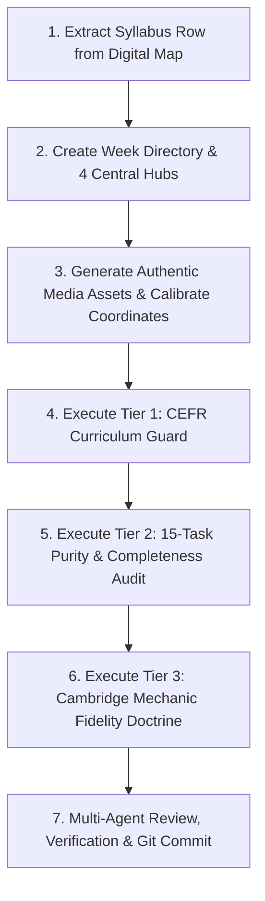

# 🏭 ENGQUEST3K — WEEK PRODUCTION SOP (STANDARD OPERATING PROCEDURE)

**Document Reference**: `docs/WEEK_PRODUCTION_SOP.md`  
**Version**: 2.0.0 (Unified 15 Quests / 5 Zones, 4 Central Hubs & 3-Tier Quality Gates)  
**Governing Standard**: Cambridge CEFR & W33 Golden Standard Architecture  
**Effective Date**: 2026-09-04  
**Status**: 🟢 **CANONICAL PRODUCTION SOP**

---

## 1. Core Production Philosophy & Master Invariants

Every week created for EngQuest3K (from Week 01 to Week 156) must adhere strictly to these fundamental principles:

1. **Master 15-Quest / 5-Zone Invariant**:
   - Every week operates on **exactly 5 Days = 5 Zones = 15 Quests** (3 Quests per day).
   - Fragmented legacy "stations" (`explore.js`, `dictation.js`, `daily_watch.js`, `logic_lab.js`) are **strictly prohibited** as standalone data files.
2. **Four Central Data Hubs Invariant**:
   - All week content lives exclusively in **4 Data Hubs**: `reading_hub.js`, `listening_hub.js`, `writing_hub.js`, `speaking_hub.js`.
3. **Zero-Cloning & Single-Source Invariant**:
   - Weeks are authored from the authoritative syllabus (`docs/1. NEW-FINAL_Khung CT_SYLLABUS_3yrs copy.txt` and `docs/ENGQUEST_DIGITAL_SYLLABUS_W01_W156_MAP.md`).
   - Copying raw content or hardcoded strings from older weeks without adapting them to the new week's theme is strictly prohibited.
4. **Standard Task Naming & CLIL Sư Phạm Invariant**:
   - **`science_lab` MUST be displayed as `Action Lab`** on all UI screens, reflecting interdisciplinary CLIL (science, social studies, geography, history, and experimental problem-solving). Never display as "Science Lab".
   - **`science_report` MUST be displayed as `Discovery Report`**.
   - **`sentence_smash` MUST be displayed as `Grammar Duel`**.
   - **`math_quest` MUST be displayed as `Math Quest`**.
   - **`broadcast_studio` MUST be displayed as `Video Challenge`**.
5. **No-Fallback & Fail-Loud Invariant**:
   - Interactive components must never use silent dummy text fallbacks. If required data is missing from the hub, render an explicit warning banner and fail loudly during audit.
6. **Authentic Cambridge 2-Play Loop Invariant**:
   - Listening Part 1–5 audios must follow the authentic Cambridge cycle:
     $$\text{Play 1} \longrightarrow \text{"Now listen to Part X again."} \longrightarrow \text{3-second pause} \longrightarrow \text{Play 2} \longrightarrow \text{"That is the end of Part X."}$$
7. **Speaking Part 3 (Picture Story) Standard**:
   - Supports 4 or 5 images. Examiner introduces Picture 1; student narrates subsequent pictures (Pictures 2–4 or Pictures 2–5).

---

## 2. Universal Weekly Structure: 15 Quests / 5 Zones

```
WEEKLY STRUCTURE (15 TASKS / 5 DAYS):
├── DAY 1: Zone 1 — Story World
│    ├── Quest 1: gear1_webtoon      ──> Scene Explorer (Comic immersion)
│    ├── Quest 2: gear2_karaoke      ──> Voice Shadow (Acoustic karaoke sync)
│    └── Quest 3: gear3_retell       ──> Story Retell (ESL Collocation Chunks)
├── DAY 2: Zone 2 — Knowledge Lab
│    ├── Quest 1: gear4_clil         ──> Fact Finder (Non-fiction reading & audio glossary)
│    ├── Quest 2: science_lab        ──> Action Lab (Interdisciplinary experiment / problem)
│    └── Quest 3: science_report     ──> Discovery Report (Observation Data Card + 1-Tap Pills)
├── DAY 3: Zone 3 — Battle Arena
│    ├── Quest 1: word_blitz         ──> Speed Match (Fast vocabulary pairing)
│    ├── Quest 2: sentence_smash     ──> Grammar Duel (Sentence syntax battle vs AI bot)
│    └── Quest 3: math_quest         ──> Math Quest (Singapore Math Bar Models & C.U.B.E.S.)
├── DAY 4: Zone 4 — Creator Studio
│    ├── Quest 1: story_writer       ──> Story Writer (3-panel narrative writing >= 20 words)
│    ├── Quest 2: broadcast_studio   ──> Video Challenge (Webcam presentation & recording)
│    └── Quest 3: info_exchange      ──> Info Exchange (2-way Q&A cue cards with info gaps)
└── DAY 5: Zone 5 — Boss Castle (Summative Assessment)
     ├── Quest 1: boss_listening     ──> Listening Shield (Cambridge Parts 1–5 rotary)
     ├── Quest 2: boss_reading       ──> Reading & Writing Shield (Cambridge Parts 1–6 rotary)
     └── Quest 3: weekly_review      ──> Speaking & Passport (Speaking Parts 1–4 & Ceremony)
```

---

## 3. Productive Tasks Scaffolding Standard

All creative and productive tasks must provide a **3-Level Scaffolding Engine** so learners never face a blank canvas:

1. **Level 1 (Full Scaffolding)**:
   - **`story_retell`**: 100% full model sentence with tap-to-listen audio.
   - **`discovery_report`**: 1-Tap Word Pills with fill-in-the-blanks.
   - **`story_writer`**: Guided Cloze frame with word options for each of the 3 pictures.
   - **`broadcast_studio`**: Auto-scrolling teleprompter with karaoke timing.
   - **`info_exchange`**: Full question given with model audio pronunciation.
2. **Level 2 (Moderate Scaffolding / Chunks)**:
   - **`story_retell`**: Linear Thinking ESL Collocation chunks in brackets (`Jake was [walking carefully] down the [school corridor].`). Cheating-proof, never alternating single-word blanks.
   - **`discovery_report`**: Sentence starters linking to the Data Card (`The data proves that... because...`).
   - **`story_writer`**: Collocation keyword pills (4–5 phrase chunks per picture).
   - **`broadcast_studio`**: Chunk-segmented teleprompter with breath pause markers (`//`).
   - **`info_exchange`**: Question scaffolding stems (`Where / science room?` $\rightarrow$ learner forms question).
3. **Level 3 (Autonomous / Open)**:
   - **`story_retell`**: Key character and verb prompt outline.
   - **`discovery_report`**: Full CER Canvas (Claim, Evidence, Reasoning) with transition word bank.
   - **`story_writer`**: Open 3-picture composition with word counter gauge and 5-Shield rubric checklist.
   - **`broadcast_studio`**: Bulleted talking point cue cards and presentation timer.
   - **`info_exchange`**: Raw cue cards with only field names given; student forms questions independently.

---

## 4. The Dictation 3-Step Engine

Whenever dictation exercises occur (Cambridge Listening Part 2 notepad note-taking, spelling, and everyday dialogue):
1. **Step 1: Authentic Two-Play Listening**:
   - Audio plays twice with a 3-second thinking pause.
   - Student types notes into digital notepad without visual prompts.
2. **Step 2: Visual Diff Verification**:
   - System displays a character-level color-coded visual diff (Green for correct, Red for missing or typo).
3. **Step 3: Listen & Shadow Loop**:
   - Plays target native audio model.
   - Student records voice repeating the sentence with real-time feedback on pronunciation and rhythm.

---

## 5. The 7-Step Production Workflow for New Weeks



### Step 1: Extract Parameters from Digital Syllabus Map
- Read `docs/ENGQUEST_DIGITAL_SYLLABUS_W01_W156_MAP.md` for Week $N$.
- Extract: `theme`, `cefr_stage`, `exam_milestone`, `clil_stem_module`, `scaffolding_tier`, `target_vocab`, `grammar_focus`.

### Step 2: Author the 4 Central Hubs
Create directory `src/data/weeks/week_{N}/` containing:
- `index.js`: Week metadata, title, CEFR level, export bundling.
- `reading_hub.js`:
  - `webtoon_scenes`: 5 comic panels with dialogue, character names, and audio URLs.
  - `retell_questions`: Story retell sentences with Linear Thinking ESL `chips` (collocation chunks).
  - `clil_article`: Non-fiction passage with `part_1_title`, `part_2_title`, and `glossary` ($\ge 3$ entries).
  - `rw_part1` through `rw_part6`: Exact Cambridge Reading & Writing parts for assessment.
- `listening_hub.js`:
  - `action_lab`: Interdisciplinary experiment parameters (Action Lab).
  - `singapore_math`: 5 C.U.B.E.S. word problems with Bar Model SVG paths.
  - `word_blitz`: 8–10 speed match vocabulary pairs.
  - `sentence_smash`: 5–8 grammar duel scramble sentences.
  - `listening_p1` through `listening_p5`: Exact Cambridge Listening parts (1 example + 5 scored + 1 distractor for L1; 2-play loop).
- `writing_hub.js`:
  - `picture_story`: 3 pictures with 3-level scaffolding (`pills`, `collocations`, `open`).
  - `rw_part_7`: Cambridge Part 7 story writing ($\ge 20$ words).
- `speaking_hub.js`:
  - `broadcast_studio`: Video challenge teleprompter script and speaker cues.
  - `info_exchange_cards`: Candidate Card A + Examiner Card B with $\ge 2$ unknown info gaps and examiner audio questions.
  - `find_differences`: 4–6 differences with calibrated hotspot coordinates (0–100% image space).
  - `picture_story`: 4 or 5 story pictures with examiner intro and picture 1 narration.
  - `personal_questions`: 3–5 examiner interview questions across family, school, and hobbies.

### Step 3: Produce Authentic Media Assets & Calibrate Coordinates
- **Webtoon Images**: Save 5 story panels in `public/images/week{N}/`.
- **Singapore Math**: Generate 5 clean Bar Model SVGs in `public/images/week{N}/bar_models/`.
- **Audio Assets**: Pre-generate examiner questions and dialogue MP3s in `public/audio/week{N}/`.
- **Hotspot Calibration**: Run visual calibrator tool (`npm run calibrate:diff {N}`) to record hotspot centroids into `docs/week{N}_hotspot_calibration.json`.

---

## 6. The 3-Tier Quality Gates Pipeline

Every week MUST pass all 3 automated gates before being merged:

### Tier 1: CEFR Curriculum Guard
```bash
npm run audit:cefr {N}
# or: node scripts/cefr_curriculum_guard.mjs {N}
```
- **Pass Criteria**:
  - 0 B2/C1 vocabulary violations for Stage 1 (W01–W72).
  - Sentence length $\le 24$ words for narrative, $\le 28$ words for CLIL scientific texts.

### Tier 2: 15-Task Purity & Completeness Audit
```bash
node scripts/audit_all_w33_tasks.mjs
# or week-specific runner
```
- **Pass Criteria**:
  - 100% PASS across all 15 tasks (0 issues).
  - Zero hardcoded fallback strings in components.
  - All 5 Zones mount cleanly with authentic data.

### Tier 3: Cambridge Mechanic Fidelity Doctrine & Content Quality
```bash
node scripts/gate17_fidelity_doctrine.mjs {N}
node scripts/gate16_content_quality.mjs {N}
```
- **Pass Criteria**:
  - `schemaValid: true`, 0 schema errors against `schemas/cambridge-flyers-fidelity-doctrine.schema.json`.
  - All 14 Invariants PASS (`INV-HUB`, `INV-L1`, `INV-L4`, `INV-L5`, `INV-R1`..`INV-R6`, `INV-S1`, `INV-S2`, `INV-S3`, `INV-CLIL`).
  - 100% Component existence verified.
  - Single-source Singapore Math equality 5/5 matched.
  - S3 Speaking Part 3 accepts 4 or 5 images.

---

## 7. Multi-Agent Review Protocol & Verification Checklist

Before pushing to production, the authoring agent must execute the **Multi-Agent Review Checklist**:

- [ ] **Variable Declarations**: No undeclared variables or TDZ risks.
- [ ] **Cheat-proofing**: Speech recognition requires authentic voice input; no bypass length mocks.
- [ ] **Data Integrity**: `logAttempt` called only when `isAttempted: true`.
- [ ] **Build Verification**: `npm run build` exits with code 0.
- [ ] **Manifest Drift Test**: `npm run test:manifest:drift` passes.
- [ ] **Reviewer Report**: Documented in commit message or PR summary with:
  ```markdown
  ## 📋 Multi-Agent Review Report — Commit <hash>
  ### 🔴 CRITICAL BUGS: 0
  ### 🟡 HIGH RISKS: 0
  ### ✅ PASSED: 15/15 Quests Verified & 3-Tier Gates Passed
  ```
