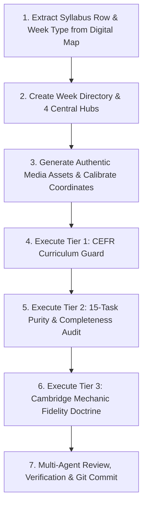

# 🏭 ENGQUEST3K — WEEK PRODUCTION SOP (STANDARD OPERATING PROCEDURE)

**Document Reference**: `docs/WEEK_PRODUCTION_SOP.md`  
**Version**: 2.2.0 (Unified 15 Quests / 5 Zones + Lite Mode W01–W16, Multi-Level Assessment & 28-Mock Test Cadence)  
**Governing Standard**: Cambridge CEFR (Pre-A1 to B1+) & W33 Golden Standard Architecture  
**Effective Date**: 2026-09-05  
**Status**: 🟢 **CANONICAL PRODUCTION SOP**

---

## 1. Core Production Philosophy & Master Invariants

Every week created for EngQuest3K (from Week 01 to Week 156) must adhere strictly to these fundamental principles:

1. **Master 15-Quest / 5-Zone Invariant (W17–W156)**:
   - Every week from W17 onward operates on **exactly 5 Days = 5 Zones = 15 Quests** (3 Quests per day).
   - Fragmented legacy "stations" (`explore.js`, `dictation.js`, `daily_watch.js`, `logic_lab.js`) are **strictly prohibited** as standalone data files.
   - **⚠️ LITE MODE (W01–W16)**: Pre-A1 Starters weeks operate on **10 Quests / 5 Zones (2 Quests/Day)** due to cognitive load constraints for 6–7 year olds. See MASTER_ARCHITECTURE §9 for details.
2. **Four Central Data Hubs Invariant**:
   - All week content lives exclusively in **4 Data Hubs**: `reading_hub.js`, `listening_hub.js`, `writing_hub.js`, `speaking_hub.js`.
3. **Zero-Cloning & Single-Source Invariant**:
   - Weeks are authored from the authoritative syllabus (`docs/1. NEW-FINAL_Khung CT_SYLLABUS_3yrs copy.txt` and `docs/ENGQUEST_DIGITAL_SYLLABUS_W01_W156_MAP.md`).
   - Copying raw content or hardcoded strings from older weeks without adapting them to the new week's theme is strictly prohibited.
4. **Hai Hình Thái Tuần Học (Two Production Modalities)**:
   - **Type A: Tuần Luyện Tập Xoay Vòng (Rotary Practice Week — 80% số tuần)**: Zone 5 trên Day 5 đánh giá quá trình tập trung sâu vào **4 Cambridge Parts xoay vòng**.
   - **Type B: Tuần Thi Thử Trọn Vẹn (Full Mock Test Week — 28 tuần trên toàn khóa)**: Cờ `isFullMock: true` trong `index.js`. Zone 5 kích hoạt toàn bộ bài thi chuẩn hóa có đếm ngược thời gian nghiêm ngặt.
5. **Standard Task Naming & CLIL Sư Phạm Invariant**:
   - **`science_lab` MUST be displayed as `Action Lab`** on all UI screens, reflecting interdisciplinary CLIL (science, social studies, geography, history, and experimental problem-solving). Never display as "Science Lab".
   - **`science_report` MUST be displayed as `Discovery Report`**.
   - **`sentence_smash` MUST be displayed as `Grammar Duel`**.
   - **`math_quest` MUST be displayed as `Math Quest`**.
   - **`broadcast_studio` MUST be displayed as `Video Challenge`**.
6. **No-Fallback & Fail-Loud Invariant**:
   - Interactive components must never use silent dummy text fallbacks. If required data is missing from the hub, render an explicit warning banner and fail loudly during audit.
7. **Authentic Cambridge 2-Play Loop Invariant**:
   - Listening Part 1–5 audios must follow the authentic Cambridge cycle:
     $$\text{Play 1} \longrightarrow \text{"Now listen to Part X again."} \longrightarrow \text{3-second pause} \longrightarrow \text{Play 2} \longrightarrow \text{"That is the end of Part X."}$$
8. **Speaking Part 3 (Picture Story) Standard**:
   - Supports 4 or 5 images. Examiner introduces Picture 1; student narrates subsequent pictures (Pictures 2–4 or Pictures 2–5).
9. **Action Lab 3-Scenario Depth Standard**:
   - The Action Lab must feature 3 distinct interactive scenarios/diagrams (`stages: [Stage 1, Stage 2, Stage 3]`) covering physical causes, materials comparison, and safety/first aid procedures. Never ship a single-image trivial lab.
10. **Canonical Audio Fallback Hierarchy Invariant**:
    - Pre-generated Static MP3 (in `public/audio/week{N}/` & Cloudflare R2 CDN) $\rightarrow$ Client IndexedDB Cache (`TTSCache.get`) $\rightarrow$ Google Cloud TTS Direct (only when uncached or live dynamic) $\rightarrow$ Browser TTS fallback (only on fatal error). All components must supply valid `audioUrl` parameters.
11. **Dual-Store Universal Progress Persistence & Return-to-Map Navigation Invariant (2026-09-05)**:
    - All 15 Quests must save completion to both `useDailyQuestStore` (`completedQuests['w' + weekId][questId]`) and `useUserStore` (`progressCache[weekId][stationId]` + Supabase cloud backup).
    - `useDailyQuestStore.completeQuest` is the single canonical entry point with automatic alias mapping (`science_lab` $\leftrightarrow$ `action_lab`, `story_writer` $\leftrightarrow$ `story_writing`, `broadcast_studio` $\leftrightarrow$ `video_challenge`, `gear4_clil` $\leftrightarrow$ `clil`).
    - Every Quest component must accept `onBackToMap` / `onComplete` and provide a clean, celebratory return path to the Quest Map (`/week/{weekId}/hub/1`) without getting trapped.

---

## 2. Universal Weekly Structure: 15 Quests / 5 Zones

```
WEEKLY STRUCTURE (15 TASKS / 5 DAYS):
├── DAY 1: Zone 1 — Story World
│    ├── Quest 1: gear1_webtoon      ──> Scene Explorer (Comic immersion)
│    ├── Quest 2: gear2_karaoke      ──> Voice Shadow (Acoustic karaoke sync)
│    └── Quest 3: gear3_retell       ──> Story Retell (ESL Collocation Chunks)
├── DAY 2: Zone 2 — Knowledge Lab
│    ├── Quest 1: gear4_clil         ──> Fact Finder (Non-fiction reading & audio glossary)
│    ├── Quest 2: science_lab        ──> Action Lab (Interdisciplinary experiment / problem)
│    └── Quest 3: science_report     ──> Discovery Report (Observation Data Card + 1-Tap Pills)
├── DAY 3: Zone 3 — Battle Arena
│    ├── Quest 1: word_blitz         ──> Speed Match (Fast vocabulary pairing)
│    ├── Quest 2: sentence_smash     ──> Grammar Duel (Sentence syntax battle vs AI bot)
│    └── Quest 3: math_quest         ──> Math Quest (Singapore Math Bar Models & C.U.B.E.S.)
├── DAY 4: Zone 4 — Creator Studio
│    ├── Quest 1: story_writer       ──> Story Writer (3-panel narrative writing >= 20 words)
│    ├── Quest 2: broadcast_studio   ──> Video Challenge (Webcam presentation & recording)
│    └── Quest 3: info_exchange      ──> Info Exchange (2-way Q&A cue cards with info gaps)
└── DAY 5: Zone 5 — Boss Castle (Summative Assessment)
     ├── Quest 1: boss_listening     ──> Listening Shield (Cambridge Parts 1–5 rotary / Mock)
     ├── Quest 2: boss_reading       ──> Reading & Writing Shield (Parts 1–6 rotary / Mock)
     └── Quest 3: weekly_review      ──> Speaking & Passport (Speaking Parts 1–4 / Debate)
```

---

## 3. Ba Thế Hệ Khảo Thí Zone 5 (Day 5: Boss Castle)

Tùy thuộc vào tuần đang sản xuất thuộc giai đoạn nào, Zone 5 sẽ nạp dữ liệu theo đúng chuẩn khảo thí của thế hệ đó:

1. **Thế hệ 1 (Weeks 01–72): Cambridge Young Learners (Starters $\rightarrow$ Movers $\rightarrow$ Flyers)**:
   - `boss_listening`: Listening Parts 1–5 (vẽ đường nối, ghi chép notepad, nối thẻ A-H, trắc nghiệm 3 tranh, tô màu và viết).
   - `boss_reading`: Reading Parts 1–6 + Part 7 Writing truyện 3 tranh $\ge 20$ từ.
   - `weekly_review`: Speaking Parts 1–4 (tìm điểm khác, info exchange, kể tiếp truyện tranh, phỏng vấn). Thang điểm **15 Khiên Cambridge**.
2. **Thế hệ 2 (Weeks 73–112): Cambridge B1 Preliminary (PET) & CLIL STEM Lab**:
   - `boss_listening`: PET Listening Parts 1–4 (7 hội thoại ngắn, note completion thông báo, phỏng vấn độc thoại dài, hội thoại quan điểm).
   - `boss_reading`: PET Reading Parts 1–6 (biển báo, matching người-văn bản, gapped text điền câu, open cloze) + Writing viết email/bài báo $\ge 100$ từ.
   - `weekly_review`: PET Speaking Parts 1–4 + Vấn đáp thực nghiệm khoa học **CLIL CER Viva Voce**. Thang điểm **Cambridge English Scale 140–160**.
3. **Thế hệ 3 (Weeks 113–156): B1+ Strong Academic Reading & Structured Opinion**:
   - `boss_listening`: B1+ Academic Listening 4 Parts (nghe bài giảng khoa học, note-taking podcast học thuật, hội thoại chuyên đề dài).
   - `boss_reading`: B1+ Academic Reading 6 Parts (đọc bài văn 500–800 từ, trích xuất luận điểm, inference questions, gapped text) + Writing Opinion Essay $\ge 140–190$ từ và Extended Project Report $\ge 500$ từ.
   - `weekly_review`: Thuyết trình quan điểm có chuẩn bị (Structured Opinion Presentation 3–5 phút) + Ghi hình Extended Project Report + Phỏng vấn học thuật. Thang điểm **B1+ Academic Proficiency Scale + Portfolio Grade (A/B/C/D)**.

---

## 4. Chu Kỳ 28 Tuần Full Mock Test

Khi biên soạn tuần có mã `★ FULL MOCK`, tác giả bắt buộc phải khai báo:
```javascript
// src/data/weeks/week_XX/index.js
export default {
  weekNumber: XX,
  isFullMock: true,
  mockExamType: "FLYERS" // hoặc "STARTERS", "MOVERS", "B1_PET", "B2_FCE_ACELLUS"
  // ...
};
```

### Danh mục 28 Tuần Mock Test:
- **Starters (1 Mock)**: W16
- **Movers (2 Mocks)**: W24, W32
- **Flyers (8 Mocks - Nhịp 4+1)**: W37, W42, W47, W52, W57, W62, W67, W72 (Official Flyers Gate)
- **B1 PET & CLIL (8 Mocks - Nhịp 4+1)**: W77, W82, W87, W92, W97, W102, W107, W112 (Official PET Gate)
- **B2 FCE & Acellus (9 Mocks - Nhịp 4+1)**: W117, W122, W127, W132, W137, W142, W147, W152, W156 (Final Capstone & Graduation)

> **Note**: Giai đoạn W113–W156 mục tiêu điều chỉnh thành **B1+ Academic Reading & Structured Opinion** (thay vì B2 FCE/Acellus). Mock Test labels trên UI hiển thị là `★ B1+ Academic Assessment Mock`.

---

## 5. Productive Tasks Scaffolding Standard

All creative and productive tasks must provide a **3-Level Scaffolding Engine** so learners never face a blank canvas:

1. **Level 1 (Full Scaffolding)**:
   - **`story_retell`**: 100% full model sentence with tap-to-listen audio.
   - **`discovery_report`**: 1-Tap Word Pills with fill-in-the-blanks.
   - **`story_writer`**: Guided Cloze frame with word options for each of the 3 pictures.
   - **`broadcast_studio`**: Auto-scrolling teleprompter with karaoke timing.
   - **`info_exchange`**: Full question given with model audio pronunciation.
2. **Level 2 (Moderate Scaffolding / Chunks)**:
   - **`story_retell`**: Linear Thinking ESL Collocation chunks in brackets (`Jake was [walking carefully] down the [school corridor].`). Cheating-proof, never alternating single-word blanks.
   - **`discovery_report`**: Sentence starters linking to the Data Card (`The data proves that... because...`).
   - **`story_writer`**: Collocation keyword pills (4–5 phrase chunks per picture).
   - **`broadcast_studio`**: Chunk-segmented teleprompter with breath pause markers (`//`).
   - **`info_exchange`**: Question scaffolding stems (`Where / science room?` $\rightarrow$ learner forms question).
3. **Level 3 (Autonomous / Open)**:
   - **`story_retell`**: Key character and verb prompt outline.
   - **`discovery_report`**: Full CER Canvas (Claim, Evidence, Reasoning) with transition word bank.
   - **`story_writer`**: Open 3-picture composition with word counter gauge and Rubric checklist.
   - **`broadcast_studio`**: Bulleted talking point cue cards and presentation timer.
   - **`info_exchange`**: Raw cue cards with only field names given; student forms questions independently.

---

## 6. The Dictation 3-Step Engine

Whenever dictation exercises occur (Cambridge Listening Part 2 notepad note-taking, spelling, and everyday dialogue):
1. **Step 1: Authentic Two-Play Listening**:
   - Audio plays twice with a 3-second thinking pause.
   - Student types notes into digital notepad without visual prompts.
2. **Step 2: Visual Diff Verification**:
   - System displays a character-level color-coded visual diff (Green for correct, Red for missing or typo).
3. **Step 3: Listen & Shadow Loop**:
   - Plays target native audio model.
   - Student records voice repeating the sentence with real-time feedback on pronunciation and rhythm.

---

## 7. The 7-Step Production Workflow for New Weeks



### Step 1: Extract Parameters from Digital Syllabus Map
- Read `docs/ENGQUEST_DIGITAL_SYLLABUS_W01_W156_MAP.md` for Week $N$.
- Check whether Week $N$ is a **Rotary Practice Week** or a **Full Mock Test Week**.
- Extract: `theme`, `cefr_stage`, `exam_milestone`, `clil_stem_module`, `scaffolding_tier`, `target_vocab`, `grammar_focus`.

### Step 2: Author the 4 Central Hubs
Create directory `src/data/weeks/week_{N}/` containing:
- `index.js`: Week metadata, title, CEFR level, `isFullMock`, export bundling.
- `reading_hub.js`: Webtoon panels, retell collocations, CLIL article, and reading assessment parts.
- `listening_hub.js`: Action Lab experiment, Singapore Math problems & SVGs, Speed Match, Grammar Duel, and listening assessment parts.
- `writing_hub.js`: Creative story writing with 3-level scaffolding and writing assessment parts.
- `speaking_hub.js`: Video Challenge teleprompter, Info Exchange cue cards, Spot-Differences with calibrated coordinates, and speaking assessment parts.

### Step 3: Produce Authentic Media Assets & Calibrate Coordinates
- **Webtoon Images**: Save 5 story panels in `public/images/week{N}/`.
- **Singapore Math**: Generate 5 clean Bar Model SVGs in `public/images/week{N}/bar_models/`.
- **Audio Assets**: Pre-generate examiner questions and dialogue MP3s in `public/audio/week{N}/`.
- **Hotspot Calibration**: Run visual calibrator tool (`npm run calibrate:diff {N}`) to record hotspot centroids into `docs/week{N}_hotspot_calibration.json`.

---

## 8. The 3-Tier Quality Gates Pipeline

Every week MUST pass all 3 automated gates before being merged:

### Tier 1: CEFR Curriculum Guard
```bash
npm run audit:cefr {N}
```
- **Pass Criteria**:
  - 0 B2/C1 vocabulary violations for Stage 1 (W01–W72).
  - Sentence length $\le 24$ words for narrative, $\le 28$ words for CLIL scientific texts.

### Tier 2: 15-Task Purity & Completeness Audit
```bash
node scripts/audit_all_w33_tasks.mjs
```
- **Pass Criteria**:
  - 100% PASS across all 15 tasks (0 issues).
  - Zero hardcoded fallback strings in components.
  - All 5 Zones mount cleanly with authentic data.

### Tier 3: Cambridge Mechanic Fidelity Doctrine & Content Quality
```bash
node scripts/gate17_fidelity_doctrine.mjs {N}
node scripts/gate16_content_quality.mjs {N}
```
- **Pass Criteria**:
  - `schemaValid: true`, 0 schema errors against schema definition.
  - All 14 Invariants PASS.
  - 100% Component existence verified.
  - Single-source Singapore Math equality 5/5 matched.
  - S3 Speaking Part 3 accepts 4 or 5 images.

---

## 9. Multi-Agent Review Protocol & Verification Checklist

Before pushing to production, the authoring agent must execute the **Multi-Agent Review Checklist**:

- [ ] **Variable Declarations**: No undeclared variables or TDZ risks.
- [ ] **Cheat-proofing**: Speech recognition requires authentic voice input; no bypass length mocks.
- [ ] **Data Integrity**: `logAttempt` called only when `isAttempted: true`.
- [ ] **Build Verification**: `npm run build` exits with code 0.
- [ ] **Manifest Drift Test**: `npm run test:manifest:drift` passes.
- [ ] **5-Feature Compliance**: `node scripts/gate18_feature_compliance.mjs N` exits with code 0 (or ⚠️ warnings-only for W33–W48).
- [ ] **Reviewer Report**: Documented in commit message or PR summary.

---

## 10. 5-Feature Data Contracts (v2.0.0 — 2026-09-05)

The following features require specific data contracts in week hub files. Content-writer subagents and human authors MUST include these contracts when producing new weeks.

### 10.1 Feature-to-Data Mapping

| Feature | Data Location | Required Fields | First Week Required |
|---|---|---|---|
| **SRS Leitner 5-Box** | `reading_hub.js → vocab[]` | `word`, `definition_en`, `definition_vi` | W17 (auto-enroll) |
| **Inference Questions** | `reading_hub.js → clil_article.inference_questions[]` | `id`, `text`, `type`, + type-specific fields | W38 (optional), **W49+ enforced** |
| **Quick Write Panel** | None (dynamic prompts from context) | — | — |
| **Placement Test** | `data/placementTest.js` (one-time) | — | — |
| **Parent Dashboard Radar** | Computed from quest completion data | — | — |

### 10.2 Inference Questions Contract

Each `clil_article` in `reading_hub.js` MUST include an `inference_questions` array:

```javascript
inference_questions: [
  {
    id: 'infer_1',                           // Must start with "infer_"
    text: 'Why did Jake help the new student?', // "Why?" or "What can we learn?" format
    type: 'mcq_with_evidence',               // or 'open_response'
    options: ['Because...', 'Since...', 'Due to...'], // 3–4 options (MCQ only)
    correct: 0,                              // index of correct answer (MCQ only)
    scaffoldHint: 'Look at paragraph 2...',  // optional scaffold for Learn mode
  },
  {
    id: 'infer_2',
    text: 'What can we learn from this experiment?',
    type: 'open_response',
    modelAnswer: 'We can learn that...',     // required for open_response
    acceptableKeywords: ['friction', 'force', 'surface'], // required for scoring
  },
]
```

**Minimum counts by generation:**
- Gen 1 (W33–W72, A2 Flyers): ≥2 items
- Gen 2 (W73–W112, B1 PET): ≥2 items
- Gen 3 (W113–W156, B1+ Academic): ≥3 items (deeper analytical types)

### 10.3 Vocab SRS Contract

The `vocab` array in `reading_hub.js` MUST have **exactly 20 items**, each with:
- `word` (string) — the target vocabulary word
- `definition_en` (string) — English definition
- `definition_vi` (string) — Vietnamese definition with full diacritics

These fields are consumed by the SRS Leitner 5-Box system for automatic flashcard enrollment.

### 10.4 Golden Templates

Reference templates for content-writer subagents:

| Template | Range | Path |
|---|---|---|
| Flyers Rotary (80% of weeks) | W33–W72 | `production_kit/templates/template_flyers_rotary.js` |
| Flyers Full Mock (20%) | W37, W42, ... W72 | `production_kit/templates/template_flyers_mock.js` |
| PET Transition | W73–W112 | `production_kit/templates/template_pet_transition.js` |
| B1+ Academic Transition | W113–W156 | `production_kit/templates/template_b1plus_transition.js` |

### 10.5 Automated Gate Validation

```bash
# Run after content creation, before commit
node scripts/gate18_feature_compliance.mjs <weekNumber>
```

**Enforcement timeline:**
- **W33–W48**: Warnings only (transition period, gate exits 0)
- **W49+**: Strict enforcement (gate exits 1 on missing data)

---

## 11. Universal Progress Persistence & Return-to-Map Navigation Standards (W01–W156)

### 11.1 The Dual-Store Architecture
EngQuest3K uses two synchronized state stores for user progress:
1. **`useDailyQuestStore` (`src/stores/useDailyQuestStore.js`)**:
   - Manages Day 1–5 unlock progression, 15 Quests completion matrix (`completedQuests['w' + weekId][questId]`), and XP/streak gamification.
   - Authoritative dispatcher: `completeQuest(weekId, questId, options)`.
   - Built-in `QUEST_ALIAS_MAP` automatically harmonizes technical station IDs and quest names:
     - `science_lab` $\leftrightarrow$ `action_lab`
     - `story_writer` $\leftrightarrow$ `story_writing`
     - `broadcast_studio` $\leftrightarrow$ `video_challenge`
     - `gear4_clil` $\leftrightarrow$ `clil`
     - `science_report` $\leftrightarrow$ `discovery_report`
     - `word_blitz` $\leftrightarrow$ `speed_match`
     - `sentence_smash` $\leftrightarrow$ `grammar_duel`
     - `math_quest` $\leftrightarrow$ `bar_model`
2. **`useUserStore` (`src/stores/useUserStore.js`)**:
   - Manages user profile, local progress cache (`progressCache[weekId][stationId]`), and Supabase cloud persistence (`syncProgressToServer`).
   - Auto-updated by `useDailyQuestStore.completeQuest` on every quest completion.
3. **`useStationProgress` Hook (`src/hooks/useStationProgress.js`)**:
   - Provides station-level state (`saveProgress`, `isCompleted`, `score`).
   - Automatically synchronizes with `useDailyQuestStore.completeQuest` whenever `saveProgress(partialData, true, score)` is invoked.

### 11.2 15-Quest Completion & Navigation Checklist
Every component representing one of the 15 Quests MUST implement the following UX pattern:
1. **Prop Acceptance**: Accept `onBackToMap` and `onComplete` passed down from `TaskScreen.jsx` and Zone containers.
2. **Completion Recognition**: Read both stores on mount (`useDailyQuestStore.isQuestCompleted` or `useStationProgress.isCompleted`). If already completed:
   - Display a prominent `✓ Completed` badge in the header or hero card.
   - Allow the student to replay/review freely without losing completion state.
3. **Finish Action**: Upon completing the quest activity:
   - Call `useDailyQuestStore.getState().completeQuest(weekId, questId, { score })` or `saveProgress(..., true, score)`.
   - Provide an explicit, prominent button: e.g. `✓ Return to Map (+50 XP)` or `✓ Finish Quest & Return to Map`.
   - Trigger `onBackToMap()` or `onComplete()` to navigate cleanly back to `/week/${weekId}/hub/1`. Never leave the student trapped on a static screen.

