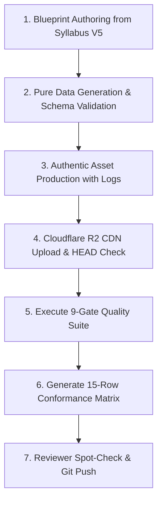

# 🏭 ENGQUEST3K WEEK PRODUCTION SOP (STANDARD OPERATING PROCEDURE)

> **Core Production Philosophy**:
> 1. **Zero-Cloning Invariant**: Weeks are generated from **Blueprint + Schema ONLY**. Importing or copying code from other weeks is strictly prohibited.
> 2. **Authentic Provenance**: Every image, audio, and SVG must be generated by declared production tools with machine logs. Generating assets via `cp` alias copying is considered a critical test fraud violation.
> 3. **Per-Quest Machine Verification**: Quality is proven only through the **15-Row Conformance Matrix** and **Runtime Truth Diff**, never through narrative assertions.

---

## 📋 THE 7-STEP PRODUCTION SEQUENCE

---

### Step 1: Blueprint Authoring (`templates/blueprint.template.json`)
- Extract weekly parameters from Syllabus V5: `theme`, `cefr_level`, `characters`, `keywords`, `target_vocab_20`, `grammar_focus`, `clil_topic`, `math_focus`, `moral`.
- Save as `src/data/weeks/week_{N}/blueprint.json`.

### Step 2: Pure Data Generation & Schema Validation
- Execute `node scripts/generate_pure_week_data.mjs {N}`.
- **Gate 9 Invariant (Generator Purity)**: The generator must ONLY accept `blueprint.json` and output 4 Hubs (`reading_hub.js`, `listening_hub.js`, `writing_hub.js`, `speaking_hub.js`).
- Validate generated data against `schemas/week_data.schema.json`.

### Step 3: Authentic Media Asset Production
- **Images (5 Webtoon Panels + 2 Covers + Cambridge Scenes)**:
  - Run `python scripts/generate_week_images.py {N}` using Flux / Imagen 3 prompts.
  - Save to `public/images/week{N}/` and save execution logs to `docs/week_{N}_qa/asset_gen.log`.
- **Singapore Math (5 Bar Model SVGs)**:
  - Run `node scripts/generate_bar_models.mjs {N}` to generate clean, distinct SVG diagrams.
- **Audio (Shadowing, Dictation, CLIL, Boss Listening)**:
  - Run batch TTS generator saving pre-generated MP3s to `public/audio/week{N}/`.

### Step 4: Cloudflare R2 CDN Upload & HEAD 200 Audit
- Run `python tools/upload_week_images_boto3.py {N}` and `python tools/upload_week_audio.py {N}`.
- Verify 100% of uploaded URLs return `HTTP 200 OK`.

### Step 5: Execute Automated 9-Gate Quality Suite
Run `npm run audit:week {N}`:
- **Gate 1**: Full-Corpus Blueprint Conformance & Anti-Leak (0 leaks across all 25 files).
- **Gate 2**: Atomic Alignment `{id, text, words[], ipa[]}` & 3 Calibrated Pins/Scene.
- **Gate 3**: Media Reference Integrity (0 broken paths, distinct byte hashes).
- **Gate 4**: ESL Linear Thinking Chunk Bolding (`**...**` with punctuation outside).
- **Gate 5**: Positive-Assertion Runtime Smoke & Deep Cambridge Task Testing.
- **Gate 6**: XP Economy & Badge Consistency.
- **Gate 7**: CEFR Stage 1 Guard (0 B1/B2 jargon, <= 22 words/sentence).
- **Gate 8**: 15-Quest Hub Invariants & Component Mount Trace.
- **Gate 9**: Generator Purity & Zero-Clone Audit.

### Step 6: Generate 15-Row Conformance Matrix
- Execute `node scripts/generate_conformance_matrix.mjs {N}`.
- Export `docs/week{N}_conformance_matrix.json` and render Markdown Matrix.
- Ensure **0 RED CELLS across all 15 Quests $\times$ 5 Criteria**.

### Step 7: Final Spot-Check & Commit
- Reviewer spot-checks 3 random quests and screenshots in `docs/week_{N}_qa/`.
- Commit with full artifact bundle.
