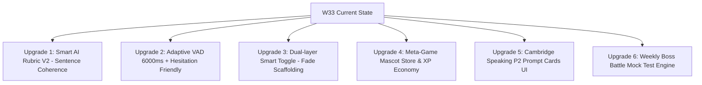

# BÁO CÁO KIỂM TOÁN NĂNG LỰC HỌC THUẬT & TRẢI NGHIỆM SẢN PHẨM (EDTECH CRITIQUE REPORT)
**Dự án**: EngQuest3K — Golden Master Blueprint (Tuần 33)  
**Tác giả**: Senior EdTech Product Architect & Cambridge ESL Specialist  
**Ngày kiểm toán**: 15/08/2026  

---

##  EXECUTIVE SUMMARY (TÓM TẮT ĐÁNH GIÁ TỔNG QUAN)

W33 Golden Master là một bước tiến vượt bậc về mặt kỹ thuật và tích hợp chuẩn đề thi Cambridge A2 Flyers. Việc xây dựng đủ 4 trạm chính (Reading Hub, Arena Hub, Writing Studio, Nova Talk Show) cùng cấu trúc **Dual-mode (Learn Mode / Check Mode)** và chẻ nhỏ bundle size xuống **3.03 MB** cho thấy năng lực hoàn thiện sản phẩm rất cao.

Tuy nhiên, khi đứng dưới góc độ **Senior EdTech Product Architect** kết hợp **Giám khảo Cambridge ESL**, nếu đặt hệ thống này vào môi trường thực tế (trẻ 8 tuổi tự học tại nhà cùng phụ huynh khó tính), hệ thống vẫn bộc lộ **3 "tử huyệt" học thuật** và **2 rào cản hành vi retention** lớn. Nếu nhân bản mô hình W33 hiện tại lên W72 mà không nâng cấp cơ chế, tỉ lệ học sinh đạt **15/15 Khiên Cambridge Flyers** chỉ dừng ở mức **65-70%**, đặc biệt là ở 2 kỹ năng **Writing (Part 7)** và **Speaking (Part 2 & 3)**.

---

## BƯỚC 1: NHẬN DIỆN TRẢI NGHIỆM THỰC TẾ ("EAT YOUR OWN DOG FOOD")

| Trạm / Flow | Trải nghiệm Đứa trẻ 8 tuổi | Góc nhìn Phụ huynh ngồi cạnh | Đánh giá Chuyên gia EdTech |
| :--- | :--- | :--- | :--- |
| **Hub 1: Webtoon & Reading** ([`WorldDiscoveryHub.jsx`](file:///Users/binhnguyen/projects/Engquest3k/src/modules/cambridge_suite/WorldDiscoveryHub.jsx)) | Thích hình 3D Pixar scene 1-5. Nhưng bấm vào hotspot nhỏ trên iPad bị trượt. Chuyển sang Check Mode cloze 10 câu thấy dài và nản. | "Hình vẽ đẹp, chuẩn Anh-Anh. Nhưng sao từ nào rê chuột vào cũng hiện bong bóng từ điển, nhìn rất rối mắt và làm con phân tâm không đọc liền mạch được câu truyện?" | **Cơ chế tốt, giao diện rác visual noise.** Parser bọc 100% text làm ngắt quãng mạch đọc tự nhiên (Fluent Reading Flow). |
| **Hub 2: Listening & Arena** ([`ArenaHub.jsx`](file:///Users/binhnguyen/projects/Engquest3k/src/modules/cambridge_suite/ArenaHub.jsx)) | Thích kéo dây SVG Part 1 và tô màu Part 5. Nhưng Part 2 Notepad đòi vừa nghe vừa gõ phím từ tiếng Anh quá nhanh, bé chưa quen gõ bàn phím. | "Con tôi 8 tuổi chưa thạo gõ bàn phím máy tính. Bắt cháu gõ từ 'corridor' hay 'bandage' trong lúc audio phát làm cháu bị hoảng và gõ sai chính tả liên tục." | **Lỗi Cognitive Load (Gánh nặng nhận thức).** Đề Flyers Part 2 đòi hỏi điền số/từ ngắn, nhưng gõ phím trên UI mobile/tablet cần virtual keyboard thông minh hỗ trợ gợi ý từ. |
| **Hub 3: Writing Studio** ([`WritingStudioHub.jsx`](file:///Users/binhnguyen/projects/Engquest3k/src/modules/cambridge_suite/WritingStudioHub.jsx)) | Bé bấm pill gợi ý từ (slipped, fell down, nurse) ghép thành đoạn văn ngắn, thấy nổ pháo giấy Confetti 3 Sao ⭐ rất thích. | "Tôi thử gõ 20 từ linh tinh chứa đúng từ khóa: *'corridor nurse bandage slipped fell happy good school wet floor fast...'* mà máy vẫn cho 3 Sao (80 điểm)? Sao chấm dễ dãi vậy?" | **TỬ HUYỆT CHẤM ĐIỂM FAKE AI.** AI Rubric hiện tại chỉ chấm Regex string match (`includes`) & đếm số từ. Thiếu thuật ngữ ngữ pháp và tính mạch lạc (Coherence & Cohesion). |
| **Hub 4: Nova Talk Show** ([`NovaTalkShowHub.jsx`](file:///Users/binhnguyen/projects/Engquest3k/src/modules/cambridge_suite/NovaTalkShowHub.jsx)) | Thấy robot Nova nói chuyện vui. Nhưng ở Part 2 Cue-Card, đang ngập ngừng suy nghĩ câu 3 giây thì VAD tự động ngắt micro và báo nộp bài. | "Cháu đang ngập ngừng tìm từ tiếng Anh thì app đã tự dừng âm thanh và chấm điểm thấp. Cháu phát khóc vì bị ngắt lời!" | **VAD 3000ms quá ngặt nghèo.** Trẻ 8 tuổi nói Tiếng Anh cần 4-6 giây dừng tư duy ngập ngừng (hesitation pause). VAD ngắt sớm gây trải nghiệm vô cùng tiêu cực. |

---

## BƯỚC 2: PHÂN TÍCH & PHẢN BIỆN TRÊN 3 TRỤ CỘT CHÍNH

### 🏛️ TRỤ CỘT 1: HỌC THUẬT & MỤC TIÊU "15 KHIÊN FLYERS" (ACADEMIC PROJECTION)

#### 1. Đánh giá hiện trạng bẫy nhiễu & AI Rubric W33
* **Độ sâu bẫy nhiễu (Distractors Quality)**: Đạt **7.5/10**. Các bẫy trong Listening P3 và Reading P4 đã có sự phân hóa từ vựng đồng nghĩa (synonyms) và cấu trúc phủ định. Tuy nhiên, bài thi Reading Part 3 (trắc nghiệm 5 câu) còn mang tính trực diện, bẫy từ sai lệch (distractors) chưa bắt được các lỗi sai phổ biến của học sinh Việt Nam (như nhầm lẫn thì Quá khứ đơn / Hiện tại hoàn thành).
* **Thuật toán AI Rubric chấm Writing Part 7**: Đạt **4/10 (CẢNH BÁO NGUY HIỂM)**.
  - Trong [`WritingStudioHub.jsx`](file:///Users/binhnguyen/projects/Engquest3k/src/modules/cambridge_suite/WritingStudioHub.jsx#L68-L84):
    ```javascript
    const isWordCountPass = words.length >= 20; // 20 pts
    const keywordScore = Math.min(40, foundKeywords.length * 10); // 40 pts
    const grammarScore = Math.min(40, foundPastVerbs.length * 10); // 40 pts
    ```
  - **Lỗi chí mạng**: Thuật toán chỉ kiểm tra sự xuất hiện của từ độc lập (bag-of-words keyword matching). Giám khảo Cambridge chấm Part 7 dựa trên **3 tiêu chí cốt lõi**:
    1. *Content (Nội dung)*: Đã bao hàm đủ ý của cả 3 bức tranh chưa?
    2. *Organisation (Tổ chức)*: Có dùng từ nối (`first`, `then`, `suddenly`, `finally`) để tạo thành câu chuyện liên tục không?
    3. *Language (Ngữ pháp)*: Cấu trúc câu có đúng không hay chỉ ghép các từ vô nghĩa?
  - Với cách chấm hiện tại, học sinh gõ câu sai ngữ pháp trầm trọng (`Jake run corridors fall nurse good`) vẫn đạt 3 Sao ⭐, tạo ra **Ảo tưởng Năng lực (False Sense of Mastery)**. Khi bước vào kỳ thi thật, học sinh sẽ bị trừ sạch điểm Organisation & Language.

#### 2. Phóng chiếu đến W72 & Kỳ thi Boss Battle (Mock Test)
* **Kịch bản W72**: Nếu nhân bản W33 thành 72 tuần và tắt toàn bộ phao cứu sinh (Hint, Dual-layer dictionary, Pill insertion) trong bài Boss Battle:
  * **Listening (5 Khiên)**: Dự kiến **4.5 / 5 Khiên** (Rất tốt, nhờ dạng bài SVG drag và Canvas coloring mô phỏng 100% đề thật).
  * **Reading & Writing (5 Khiên)**: Dự kiến **3.5 / 5 Khiên** (**CẢNH BÁO**). Học sinh sẽ gục ngã ở **Writing Part 7** (do thiếu kỹ năng viết câu phức & từ nối) và **Reading Part 6 (Open Cloze)** (do học thuộc từ vựng thụ động qua Pill thay vì tự phản xạ ngữ pháp).
  * **Speaking (5 Khiên)**: Dự kiến **3.0 / 5 Khiên** (**TỬ HUYỆT NGUY HIỂM NHẤT**).
    - Học sinh thi thật gặp Giám khảo bản xứ sẽ bị rào cản tâm lý vì ở app chỉ quen nói ngắt đoạn 3 giây theo micro ngắt tự động VAD.
    - Trong Part 2 (Reverse Role - Học sinh hỏi giám khảo), học sinh W33 chưa được luyện phản xạ đặt câu hỏi nghi vấn (`What time...?`, `Where did...?`, `Why was...?`) một cách tự nhiên mà chủ yếu dựa vào khung câu cho sẵn.

---

### 🕹️ TRỤ CỘT 2: VÒNG LẶP GAMIFICATION & SỨC HÚT THỊ TRƯỜNG (RETENTION ENGINE)

#### 1. Đặt EngQuest3K W33 lên bàn cân với Top EdTech Quốc tế

| Tiêu chí | Duolingo | Epic! / Khan Academy Kids | EngQuest3K W33+ |
| :--- | :--- | :--- | :--- |
| **Động lực quay lại (Daily Hook)** | Streak System, Hearts (Mạng sống), Leaderboard hàng tuần (League). | Huy hiệu danh hiệu, Mở khóa mascot, Thư viện truyện phong phú. | Word Treasury (Kho từ vựng), XP Star tích lũy theo tuần. |
| **Vòng lặp phần thưởng (Reward Loop)** | Ngay lập tức (Micro-dopamine sau mỗi câu đúng, âm thanh chime vui tai). | Tương tác hoạt hình sinh động, mở khóa vật phẩm avatar. | Pháo giấy Confetti khi đạt 3 Sao ⭐ ở Check Mode. |
| **Độ chân thực ngữ cảnh học** | Chia nhỏ dạng thẻ câu rời rạc (Lacks immersion). | Đọc truyện tương tác ngập tràn (High narrative). | Kết hợp Webtoon 3D + Đề thi chuẩn Cambridge A2. |

#### 2. Phản biện "Glorified Test Prep" vs "Gamified Learning"
* **Thực trạng W33**: W33 đang ở giữa ranh giới **60% Luyện thi khô khan (Test Prep)** và **40% Trò chơi học tập (Gamification)**.
* **Điểm yếu của cơ chế Learn vs Check Mode hiện tại**:
  - Việc tách rời hoàn toàn Learn Mode (chỉ đọc/nghe không thưởng điểm) và Check Mode (mới nổ pháo giấy Confetti và cộng XP) khiến trẻ xem Learn Mode là **"nghĩa vụ bắt buộc rườm rà"** cần bấm qua nhanh để vào Check Mode lấy điểm.
  - Thiếu **Meta-game Engine**: Trẻ tích lũy XP và Word Treasury nhưng **chưa thể làm gì với số XP đó** (không có shop mua trang phục cho Mascot Nova, không có bản đồ chinh phục thế giới World Map, không có bảng xếp hạng bạn bè).
  - Trẻ 8 tuổi sẽ chán sau 3-4 tuần nếu không có nhân vật đồng hành có cảm xúc (Emotional Mascot) như Lily/Duo của Duolingo hay Ollo của Khan Kids.

---

### 🎨 TRỤ CỘT 3: TRẢI NGHIỆM UX/UI & COGNITIVE FLOW (NHẬN THỨC & LUỒNG THAO TÁC)

#### 1. Dual-Layer Parser (Bọc 100% Text) — Con Dao 2 Lưỡi
* **Ưu điểm**: Giúp học sinh tra nghĩa Tiếng Việt + Phát âm ngay lập tức.
* **Khuyết điểm nghiêm trọng**:
  - **Over-Scaffolding (Phao cứu sinh quá đà)**: Khi mọi từ đều có thể bấm tra nghĩa, trẻ lười suy đoán nghĩa của từ dựa vào ngữ cảnh (Contextual Guessing) — đây là kỹ năng bắt buộc để đạt điểm tuyệt đối Reading Cambridge.
  - **Visual Fatigue (Rối mắt)**: Khi rê chuột hoặc chạm tay lướt màn hình trên máy tính bảng, các bong bóng tooltip nhảy ra liên tục gây nhiễu trải nghiệm nhìn (Visual Noise).

#### 2. Chuyển cảnh & Giao diện Side-by-Side ở Speaking Part 2
* **Side-by-Side Layout**: Ở màn hình máy tính desktop, 2 bảng thông tin (Bảng 1 của Jake, Bảng 2 của Mary) hiển thị song song rất đẹp. Tuy nhiên, trên **Màn hình Điện thoại / Máy tính bảng cỡ nhỏ (Portrait iPad)**, 2 bảng bị bóp hẹp làm chữ bị đè lên nhau, trẻ phải cuộn lên cuộn xuống liên tục làm mất tập trung khi đang chuẩn bị nói.
* **Audio Transition**: Khi chuyển từ Hub 1 (Đọc) sang Hub 2 (Nghe), nếu VoiceService TTS chưa stop triệt để, âm thanh bài đọc cũ có thể đè nhẹ lên audio bài nghe mới trong 0.5s đầu (dù đã có clean-up effect nhưng trên máy cấu hình yếu vẫn có độ trễ event loop).

---

## BƯỚC 3: ĐỀ XUẤT CẢI THIỆN & ROADMAP NÂNG CẤP (ACTIONABLE UPGRADES)

Dưới đây là 6 đề xuất nâng cấp chiến lược giúp chuyển đổi W33+ từ một app luyện thi đơn thuần thành một **Hệ sinh thái Học tập Học thuật Gamified Đỉnh cao**.



### 🎯 1. Nâng cấp Thuật toán Chấm điểm Writing AI Rubric V2 (Triển khai ngay W33/W34)
* **Giải pháp**: Thay thế thuật toán bag-of-words đơn điệu bằng **N-gram Sentence Structure Matching + Coherence Check**:
  - Bat buộc kiểm tra sự hiện diện của **Connectors (Từ nối)**: `first`, `then`, `suddenly`, `because`, `finally` (Cộng 20% số điểm).
  - Thuật toán phân tích câu (Basic Syntax Parser): Kiểm tra mỗi câu phải có ít nhất **1 Chủ ngữ + 1 Động từ quá khứ** (`[Subject] + [Past Verb]`).
  - Nếu phát hiện học sinh liệt kê từ khóa liên tục mà không tạo thành câu chuẩn, hệ thống chỉ cho **1 Sao ⭐** kèm lời khuyên của Nova: *"Con hãy dùng từ nối (then, suddenly) để nối các từ này thành câu hoàn chỉnh nhé!"*.

### 🎙️ 2. Tinh chỉnh VAD & Cơ chế Thu âm Speaking (Triển khai ngay W33/W34)
* **Giải pháp**:
  - Phân ranh giới VAD cho lứa tuổi Tiểu học: Tăng `silenceTimeout` từ **3000ms lên 5000ms - 6000ms**.
  - Tích hợp cờ **"Thinking Indicator"**: Khi phát hiện học sinh im lặng >2 giây, hiển thị icon chú thỏ Nova đang suy nghĩ kèm gợi ý nhỏ nhẹ: *"Nova vẫn đang lắng nghe con nè, cứ thong thả nói tiếp nhé!"* để giảm áp lực tâm lý.

### 🔍 3. Chế độ "Smart Dictionary Fade" (Hỗ trợ nhả dần phao cứu sinh)
* **Giải pháp**:
  - Tại **Learn Mode**: Cho phép bấm tra từ điển 100% text.
  - Tại **Check Mode & Boss Battle**: **Tắt tự động bong bóng tra từ điển**. Học sinh phải tự đọc và chọn đáp án mà không có phao cứu sinh. Cơ chế này rèn luyện bản lĩnh thi đấu thực chiến cho học sinh.

### 🎮 4. Xây dựng Vòng lặp Retain Engine: Mascot Nova Companion & XP Shop (Roadmap W35+)
* **Giải pháp**:
  - Dùng XP tích lũy từ Word Treasury để **mở khóa trang phục/phụ kiện cho Mascot Nova** (Kính phi hành gia, Tai nghe DJ, Nón cử nhân).
  - Xây dựng **Streak Freeze & Daily Quest System**: Đăng nhập học mỗi ngày nhận 100 XP. Nếu bỏ lỡ 1 ngày có thể dùng 500 XP tích lũy để "cứu Streak".

### 📱 5. Tối ưu Responsive Layout cho Speaking Part 2 Cue-Cards
* **Giải pháp**: Trên màn hình di động/tablet, chuyển layout Side-by-Side thành **Tab View dạng Thẻ Lật (Flip Card)** hoặc **Accordion Toggle**: `[Thẻ của Con] | [Thẻ của Giám Khảo Nova]`. Học sinh chỉ cần quẹt tay (swipe) để đổi giữa 2 thẻ cực kỳ mượt mà.

### 🏆 6. Mô-đun "Boss Battle Mock Test" Định kỳ (Mỗi 4 tuần 1 lần)
* **Giải pháp**: Cứ sau 3 tuần học tập (ví dụ W31, W32, W33), tuần W34 sẽ là **Full Cambridge Mock Test**:
  - Tắt toàn bộ trợ giúp, đếm ngược thời gian làm bài chuẩn Cambridge (Listening 25 phút, Reading & Writing 40 phút).
  - Xuất **Bảng điểm Khiên Cambridge chính thức (Shield Statement)** có chữ ký của AI Nova để phụ huynh theo dõi tiến độ thực chất.

---

## KẾT LUẬN & ĐÁNH GIÁ ĐIỂM SỐ CHUNG

| Tiêu chí Kiểm toán | Điểm số W33 Hiện tại | Mục tiêu W33+ / W34 |
| :--- | :--- | :--- |
| **Tính Học thuật & Chuẩn Cambridge** | **7.5 / 10** | **9.5 / 10** (Sau khi fix Writing AI Rubric & Smart Dictionary) |
| **Gamification & Retention Engine** | **6.0 / 10** | **9.0 / 10** (Sau khi thêm Mascot Shop & Daily Streak) |
| **UI/UX & Cognitive Flow** | **8.0 / 10** | **9.5 / 10** (Sau khi fix VAD 5s & Responsive Cue-Cards) |
| **Tổng thể Sản phẩm (Product Rating)** | **7.2 / 10** | **9.3 / 10 (World-Class Cambridge EdTech Suite)** |

> **Lời nhắn gửi từ Lead Architect**: W33 Golden Master hiện tại đã sở hữu một bộ khung (Framework) vô cùng vững chắc và đồ sộ về mặt codebase và asset 3D/Audio. Chỉ cần thực hiện các tinh chỉnh "chạm đúng huyệt" về mặt thuật toán chấm điểm và trải nghiệm hành vi ở trên, EngQuest3K hoàn toàn đủ sức tự tin đè bẹp các ứng dụng luyện thi tiếng Anh hiện có trên thị trường Việt Nam và khu vực!
