# ENGQUEST3K WEEK 33 — BLUEPRINT GIẢI TRÌNH NỘI DUNG VÀ TƯƠNG TÁC SƯ PHẠM
> **Theme:** Corridor Safety & School Care  
> **Target Level:** Cambridge A1+ / Flyers Standard  
> **Status:** Locked Golden Master Blueprint for Week 33 and Mass Production W34+  

---

## TỔNG QUAN CẤU TRÚC SYSTEM HUB (4 HUBS · 19 SUB-TABS)

```mermaid
graph TD
  App[EngQuest3K Cambridge Suite] --> H1[Hub 1: Reading & Writing Studio]
  App --> H2[Hub 2: Arena Games & Listening Suite]
  App --> H3[Hub 3: Story Writing Studio]
  App --> H4[Hub 4: Nova Talk Show & Speaking Studio]

  H1 --> H1_1[📖 Story Time]
  H1 --> H1_2[🧩 Word Match - R&W P1]
  H1 --> H1_3[💬 Chat Box - R&W P2]
  H1 --> H1_4[📝 Fill the Blanks - R&W P4]
  H1 --> H1_5[🕵️ Story Detective - R&W P5]

  H2 --> H2_L[🎧 Listening Missions]
  H2 --> H2_A[⚔️ Arena Games]

  H2_L --> H2_1[🔗 Draw the Lines - List P1]
  H2_L --> H2_2[📋 Secret Notes - List P2]
  H2_L --> H2_3[🔍 Item Hunt - List P3]
  H2_L --> H2_4[🖼️ Picture Quiz - List P4]
  H2_L --> H2_5[🎨 Magic Color - List P5]

  H2_A --> H2_6[🧠 Sentence Builder]
  H2_A --> H2_7[📐 Bar Model Quest]
  H2_A --> H2_8[⚡ Speed Match]

  H3 --> H3_1[📝 Story Writing Studio - R&W P7]

  H4 --> H4_1[🎙️ Podcast Shadowing]
  H4 --> H4_2[💬 Personal Q&A - Speak P4]
  H4 --> H4_3[❓ Ask & Answer - Speak P2]
  H4 --> H4_4[🖼️ Picture Story - Speak P3]
  H4 --> H4_5[🔍 Find Differences - Speak P1]
```

---

# HUB 1: READING & WRITING STUDIO

### 1. 📖 Story Time (3D Webtoon & Interactive Hotspots)
*   **Mục tiêu Cambridge:** Chuẩn bị bối cảnh và từ vựng cốt lõi cho toàn bộ các phần thi Reading & Writing.
*   **Mục đích Sư phạm:** Tiếp thu ngữ liệu qua hình ảnh 3D Pixar đa giác quan; xây dựng mô hình tư duy tuyến tính (Linear Thinking) và phát âm chuẩn từng cụm từ bôi đậm (ESL Lexical Chunks).
*   **Hành động của Học sinh:** 
    1. Bấm nút Next/Back hoặc bấm các thẻ Thumbnail ở phía dưới để chuyển giữa 5 cảnh Webtoon 3D.
    2. Bấm vào các điểm Hotspot màu tím nổi trên bức tranh để nghe phát âm giọng đọc AI chuẩn của từ vựng/cụm từ đó.
*   **Nội dung Text trên UI:** 
    - Tiêu đề cảnh (Scene 1 to 5) kèm mô tả chuẩn ESL A1+.
    - Ví dụ Scene 4: `"Jake stopped immediately and walked quickly to call the school nurse for help."`
    - Nhãn Hotspot: `hurt his knee`, `called for help`.
*   **Nội dung Audio / TTS:**
    - Phát âm tức thì cụm từ khi click Hotspot (Ví dụ: `"called for help"`).
    - Giọng đọc: `en-US-Journey-F` (Phát âm mượt mà, tự nhiên).
    - Distractors: Không áp dụng cho phần đọc hiểu dẫn nhập.
*   **Logic tính điểm:** Không tính điểm xếp hạng; tính thời gian tương tác và đánh dấu hoàn thành 100% khi xem đủ 5 cảnh.

---

### 2. 🧩 Word Match (Part 1: Word Bank Matching)
*   **Mục tiêu Cambridge:** Cambridge Reading & Writing Part 1.
*   **Mục đích Sư phạm:** Đánh giá khả năng nối định nghĩa tiếng Anh với từ vựng chuẩn xác; luyện tập phương pháp loại trừ thông minh (Visual Elimination).
*   **Hành động của Học sinh:** 
    1. Đọc định nghĩa ở cột bên trái.
    2. Bấm chọn 1 từ vựng tương ứng từ kho 15 từ ở lưới bên phải.
    3. Từ đã chọn sẽ điền vào ô trống; các từ không chọn bị mờ dần. Bấm "Check Answers" để nộp bài.
*   **Nội dung Text trên UI:** 
    - Định nghĩa câu hỏi (Ví dụ: `"This is a piece of soft cloth used to cover and protect a hurt knee or arm."`).
    - Kho 15 từ vựng (Ví dụ: `bandage`, `cold pack`, `alarm clock`, `backpack`, v.v.).
*   **Nội dung Audio / TTS:**
    - Bấm nút loa cạnh từ vựng để nghe đọc từ (Ví dụ: `"bandage"`).
    - Distractors: Kho từ vựng có 15 từ nhưng chỉ có 5 định nghĩa (10 từ nhiễu).
*   **Logic tính điểm:** Đúng 1/5 câu được 20%. Sai hiển thị viền đỏ và gợi ý xem lại định nghĩa.

---

### 3. 💬 Chat Box (Part 2: Dialogue A-H)
*   **Mục tiêu Cambridge:** Cambridge Reading & Writing Part 2.
*   **Mục đích Sư phạm:** Kiểm tra kỹ năng phản xạ hội thoại thực tế, ngữ pháp giao tiếp và các cặp câu hỏi - đáp logic.
*   **Hành động của Học sinh:** 
    1. Đọc từng lượt thoại của nhân vật A trong kịch bản Chat Box.
    2. Bấm vào ô trả lời để mở ngăn kéo bên phải chứa 8 lựa chọn A đến H.
    3. Chọn thẻ thoại phù hợp nhất để hoàn thành cuộc hội thoại.
*   **Nội dung Text trên UI:** 
    - Lượt thoại nhân vật A (Ví dụ: `"Teacher: What happened in the corridor this morning, Jake?"`).
    - Thẻ đáp án A-H (Ví dụ: `A: "Tom fell down near the science lab."`).
*   **Nội dung Audio / TTS:**
    - Hỗ trợ phát âm từng lượt thoại khi cần nghe lại.
    - Distractors: 8 lựa chọn (A-H) cho 5 ô trống (3 câu nhiễu không hợp ngữ cảnh).
*   **Logic tính điểm:** Tính điểm dựa trên số câu nối đúng. Đúng 5/5 đạt 100%.

---

### 4. 📝 Fill the Blanks (Part 4: Inline Cloze & Story Title)
*   **Mục tiêu Cambridge:** Cambridge Reading & Writing Part 4 (Completing text & Choosing the best story title).
*   **Mục đích Sư phạm:** Đọc hiểu văn bản ngắn, xác định chính xác từ loại (động từ quá khứ, danh từ, tính từ) để điền vào 10 chỗ trống và chọn tiêu đề bao quát nhất cho câu chuyện.
*   **Hành động của Học sinh:** 
    1. Đọc đoạn văn ngắn liên tục có **10 khoảng trống (10 Gaps)**.
    2. Bấm trực tiếp vào từng ô trống để mở Popover Dropdown chứa 3 từ gợi ý.
    3. Chọn 1 từ thích hợp nhất để điền vào đoạn văn.
    4. Ở cuối bài, chọn 1 tiêu đề phù hợp nhất cho toàn bộ câu chuyện (Story Title Selection) từ 3 phương án gợi ý.
*   **Nội dung Text trên UI:** 
    - Đoạn văn story 10 chỗ trống: `"Tom slipped on the wet floor and ____ (hurt) his knee..."`
    - Popover Dropdown lựa chọn: `[hurt / fell / ran]`.
    - Câu hỏi chọn tiêu đề ở cuối bài: `"Now choose the best name for the story: [A) Tom's Morning Adventure / B) The Broken Alarm Clock / C) A Rainy Day]"`
*   **Nội dung Audio / TTS:**
    - Đọc phát âm từng câu trong đoạn văn khi học sinh bấm nghe.
    - Distractors: Lựa chọn bẫy từ loại (Ví dụ: cho `hurt` vs `hurting` vs `hurts` để bẫy thì Quá khứ đơn) và tiêu đề quá hẹp/quá chung chung.
*   **Logic tính điểm:** Tính điểm tỷ lệ ô điền đúng trên tổng số **10 ô trống + 1 câu hỏi chọn tiêu đề (Tổng 11 items)**.

---

### 5. 🕵️ Story Detective (Part 5: Text Extraction)
*   **Mục tiêu Cambridge:** Cambridge Reading & Writing Part 5.
*   **Mục đích Sư phạm:** Rèn luyện kỹ năng trích xuất thông tin chính xác (Text Extraction) từ bài đọc dài mà không được thay đổi từ ngữ gốc của tác giả (Giới hạn tối đa **1 đến 4 từ / 1-4 Words Limit**).
*   **Hành động của Học sinh:** 
    1. Đọc bài văn chi tiết bên cột trái.
    2. Nhập từ **1 đến 4 từ (1-4 Words Limit)** trích xuất trực tiếp từ bài đọc vào ô trống bên cột phải.
*   **Nội dung Text trên UI:** 
    - Hướng dẫn chuẩn Cambridge: `"Complete the sentences about the story. Write 1, 2, 3 or 4 words."`
    - Bài đọc bên trái: `"The school nurse arrived quickly with a clean bandage."`
    - Câu hỏi bên phải: `"The nurse brought a ____ to treat Tom."` $\rightarrow$ Học sinh nhập: `clean bandage`.
*   **Nội dung Audio / TTS:**
    - Phát âm toàn bộ bài đọc hoặc từng câu trích xuất.
    - Distractors: Học sinh phải chọn đúng cụm từ 1-4 từ (`clean bandage`), nếu chỉ nhập `bandage` sẽ được hướng dẫn trích xuất đầy đủ cụm từ.
*   **Logic tính điểm:** Chuẩn hóa chuỗi thông minh (Smart Normalization): Bỏ qua chữ hoa/chữ thường, khoảng trắng thừa và mạo từ không bắt buộc `a/an/the`. Giới hạn độ dài chuỗi nhập từ 1-4 từ.

---

# HUB 2: ARENA GAMES & LISTENING SUITE

## CATEGORY 1: 🎧 LISTENING MISSIONS

### 1. 🔗 Draw the Lines (Listening Part 1: SVG Line Matcher)
*   **Mục tiêu Cambridge:** Cambridge Listening Part 1.
*   **Mục đích Sư phạm:** Nghe miêu tả nhân vật và hành động trong bức tranh lớn; kéo đường dây nối giữa tên nhân vật và vị trí chính xác.
*   **Hành động của Học sinh:** 
    1. Bấm nút Play Audio để nghe bài đọc miêu tả bức tranh.
    2. Bấm vào tên nhân vật ở 2 bên cạnh, sau đó bấm/kéo sang điểm tròn vị trí nhân vật tương ứng trong bức tranh SVG.
    3. Đường dây màu sắc tươi sáng sẽ tự động nối 2 điểm.
*   **Nội dung Text trên UI:** 
    - Tên nhân vật (Jake, Tom, School Nurse, Headmaster, Mia).
    - Thẻ nhãn gợi ý vị trí nhân vật.
*   **Nội dung Audio / TTS:**
    - **Hội thoại 2 chiều giữa Girl và Man**:
      - *"Girl: Who is the boy in the blue hoodie walking carefully?"*
      - *"Man: That's Jake! He is walking to call the nurse."*
      - *"Girl: And who is slipping on the wet floor in the red shirt?"*
      - *"Man: Oh, that's Tom! He fell down near the science lab."*
    - **Distractors**: Trong tranh có 6 nhân vật nhưng bài nghe chỉ nhắc đến 5 tên (1 nhân vật nhiễu không có tên).
*   **Logic tính điểm:** Tính điểm dựa trên số đường dây nối đúng vị trí nhân vật.

---

### 2. 📋 Secret Notes (Listening Part 2: Notepad Note Completer)
*   **Mục tiêu Cambridge:** Cambridge Listening Part 2.
*   **Mục đích Sư phạm:** Nghe chắt lọc thông tin chi tiết (tên riêng, số nhà, thời gian, tên đồ vật) để ghi chép vào sổ tay sự cố.
*   **Hành động của Học sinh:** 
    1. Lắng nghe đoạn hội thoại chi tiết về sự cố.
    2. Ghi từ hoặc con số nghe được vào 5 dòng trống trong trang sổ tay (Notepad).
*   **Nội dung Text trên UI:** 
    - Khung sổ tay sự cố: 
      - `Incident Location: [ Corridor ]`
      - `Time of slip: [ 9:30 AM ]`
      - `First Aid Item: [ Cold Pack ]`
*   **Nội dung Audio / TTS:**
    - **Hội thoại 2 chiều giữa Thầy hiệu trưởng và Cô y tế**:
      - *"Headmaster: What time did the incident happen?"*
      - *"Nurse: It was exactly 9:30 in the morning."*
      - *"Headmaster: And what did you apply first?"*
      - *"Nurse: I applied a cold pack to his hurt knee."*
    - **Distractors**: Nghe thấy cả 9:00 AM (giờ vào lớp) nhưng sự cố xảy ra lúc 9:30 AM. Học sinh phải nghe kỹ từ chìa khóa `happen`.
*   **Logic tính điểm:** Đúng từ/số được tính điểm. Hệ thống tự động sửa lỗi gõ hoa/thường.

---

### 3. 🔍 Item Hunt (Listening Part 3: Visual Matching A-H)
*   **Mục tiêu Cambridge:** Cambridge Listening Part 3.
*   **Mục đích Sư phạm:** Nghe bài nói/hội thoại dài kể về các vị trí cất giữ đồ vật; nối 5 đồ vật với 5 thẻ tranh đúng trong tổng số 8 thẻ.
*   **Hành động của Học sinh:** 
    1. Bấm vào 1 trong 5 ô đồ vật bên cột trái (Clean Bandage, Cold Pack, Science Notebook, Orange Juice, Alarm Clock).
    2. Nghe âm thanh phát ra mô tả vị trí cất đồ vật.
    3. Bấm vào thẻ tranh tương ứng A-H ở lưới bên phải để ghép đôi.
*   **Nội dung Text trên UI:** 
    - Cột trái: Nút chữ 100% thuần text (Không có hình ảnh bên cạnh chữ).
    - Cột phải: 8 Thẻ tranh Pixar 3D sắc nét với chữ tên đồ vật nằm gọn gàng bên dưới khung ảnh. Nhãn ghép hiển thị `🎯 [Tên đồ vật]` rõ ràng.
*   **Nội dung Audio / TTS:**
    - **Hội thoại 2 chiều giữa Teacher và Jake**:
      - *"Teacher: Hello Jake! Where was the clean bandage kept?"*
      - *"Jake: The nurse kept the clean bandage in the medical cabinet, picture card A."*
      - *"Teacher: And the cold pack?"*
      - *"Jake: The cold pack was on the first aid table, picture card B!"*
    - **Distractors**: 8 thẻ tranh A-H cho 5 đồ vật (3 thẻ nhiễu: Balo, Bình nước, Hộp y tế). Trong bài nghe Jake giải thích rõ 3 đồ vật này không được sử dụng.
*   **Logic tính điểm:** Đúng 1 cặp được 20%. Sai có thể bấm nút X xóa để chọn lại.

---

### 4. 🖼️ Picture Quiz (Listening Part 4: 3-Picture Option Cards)
*   **Mục tiêu Cambridge:** Cambridge Listening Part 4.
*   **Mục đích Sư phạm:** Nghe chắt lọc thông tin chi tiết qua các câu hỏi trắc nghiệm bằng hình ảnh; nhận biết bẫy ngôn ngữ trong đoạn hội thoại.
*   **Hành động của Học sinh:** 
    1. Lắng nghe từng câu hỏi và đoạn hội thoại.
    2. Bấm chọn 1 trong 3 thẻ tranh A, B hoặc C cho mỗi câu hỏi.
*   **Nội dung Text trên UI:** 
    - Câu hỏi (Ví dụ: `"1. Where did Tom slip and hurt his knee?"`).
    - 3 thẻ tranh A, B, C minh họa các bối cảnh khác nhau.
*   **Nội dung Audio / TTS:**
    - **Hội thoại 2 chiều có BẪY NHIỄU (Distractor Dialogue)**:
      - *"Girl: Did Tom slip inside the science lab?"*
      - *"Boy: No, he was walking past the science lab, but he actually slipped on wet tiles in the school corridor!"*
      - *"Girl: Oh, so it was in the corridor, not in the lab!"*
    - **Bẫy sư phạm**: Nhắc đến cả "science lab" (Bẫy) nhưng phủ định để chốt "corridor" (Đáp án đúng). Học sinh nghe vẹt từ "science lab" sẽ chọn sai thẻ B!
*   **Logic tính điểm:** Chọn đúng thẻ tranh đạt điểm tối đa cho câu hỏi đó.

---

### 5. 🎨 Magic Color (Listening Part 5: SVG Color & Write)
*   **Mục tiêu Cambridge:** Cambridge Listening Part 5.
*   **Mục đích Sư phạm:** Nghe hướng dẫn chi tiết để tô màu đúng vào các đối tượng trong tranh và viết 1 từ ngắn vào nhãn.
*   **Hành động của Học sinh:** 
    1. Bấm Master Audio Player nghe đoạn hội thoại hướng dẫn tô màu.
    2. Bấm chọn 1 màu trong bảng màu Palette (Red, Blue, Green, Yellow, Purple, Orange).
    3. Bấm trực tiếp vào lớp hình Vector (Băng cá nhân, Túi chườm, Biển báo sàn ướt) trên bức tranh Line Art đen trắng để phủ màu.
    4. Nhập từ `'SAFE'` vào ô trống trên chân biển báo.
*   **Nội dung Text trên UI:** 
    - Khung hướng dẫn chữ **MẶC ĐỊNH BỊ ẨN** (🔒 Text is hidden! Listen to Master Audio above). Học sinh có thể bấm `"👁️ Show Text Hint"` nếu cần hỗ trợ.
    - Bảng chọn màu Palette tươi sáng.
    - Bức tranh Vector Line Art trắng đen sắc nét hiển thị bối cảnh hành lang trường học (NURSE room, hurt boy, table, wet floor sign).
*   **Nội dung Audio / TTS:**
    - **Hội thoại 2 chiều giữa Giám khảo (Examiner) và Học sinh (Student)**:
      - *"Examiner: Look at the boy with the hurt knee. Can you see his clean bandage?"*
      - *"Student: Yes, I can see it!"*
      - *"Examiner: Color the clean bandage blue."*
      - *"Student: Blue? Okay, coloring it now!"*
      - *"Examiner: Now find the cold pack on the table. Color it green."*
      - *"Examiner: Next, color the wet floor warning sign yellow."*
      - *"Examiner: Finally, write the word SAFE on the sign label."*
*   **Logic tính điểm:** Kiểm tra màu sắc tô trên từng layer vector SVG và từ viết trên nhãn. Đúng 4/4 nhiệm vụ đạt 100%.

---

## CATEGORY 2: ⚔️ ARENA GAMES

### 6. 🧠 Sentence Builder (Grammar Drill Arena)
*   **Mục tiêu Cambridge:** Củng cố ngữ pháp Cấu trúc câu & Quá khứ tiếp diễn (`when / while`).
*   **Mục đích Sư phạm:** Sắp xếp các mảnh từ thành câu hoàn chỉnh đúng cú pháp tiếng Anh.
*   **Hành động của Học sinh:** Bấm vào các thẻ từ rải rác để xếp thành dòng câu đúng thứ tự Quá khứ tiếp diễn.
*   **Nội dung Text trên UI:** Các mảnh từ: `[While Tom] [was running,] [he slipped] [on the wet floor.]`
*   **Logic tính điểm:** Xếp đúng thứ tự câu được thưởng điểm Arena và tăng chuỗi Streak.

---

### 7. 📐 Bar Model Quest (Singapore Math Quest)
*   **Mục tiêu Cambridge:** Tích hợp liên môn STEM & Giải toán sơ đồ thanh Singapore Bar Model.
*   **Mục đích Sư phạm:** Phân tích dữ kiện bài toán lời văn thông qua sơ đồ hình ảnh SVG trực quan độc bản.
*   **Hành động của Học sinh:** Quan sát sơ đồ SVG Bar Model và chọn đáp án số lượng/kết quả đúng.
*   **Nội dung Text trên UI:** Bài toán về số lượng gạc y tế/bình nước kèm sơ đồ SVG độc bản của Tuần 33.
*   **Logic tính điểm:** Chọn đúng đáp án toán học nhận thưởng sao kinh nghiệm.

---

### 8. ⚡ Speed Match (Flash Arena Vocabulary)
*   **Mục tiêu Cambridge:** Ôn tập tốc độ cao 20 từ vựng cốt lõi của tuần.
*   **Mục đích Sư phạm:** Phản xạ từ vựng tức thì (Automated Lexical Retrieval) qua game ghép thẻ lật mặt.
*   **Hành động của Học sinh:** Lật mở và ghép cặp từ tiếng Anh - nghĩa tiếng Việt/hình ảnh trong thời gian ngắn nhất.
*   **Logic tính điểm:** Ghép đúng cộng điểm combo tốc độ; tính thời gian hoàn thành toàn bộ kho từ.

---

# HUB 3: STORY WRITING STUDIO

### 1. 📝 Story Writing Studio (Part 7: 3-Picture Story Continuation)
*   **Mục tiêu Cambridge:** Cambridge Reading & Writing Part 7.
*   **Mục đích Sư phạm:** Luyện kỹ năng viết đoạn văn kể chuyện (viết từ 20 từ trở lên) dựa trên chuỗi 3 bức tranh gợi ý.
*   **Hành động của Học sinh:** 
    1. Quan sát chuỗi 3 bức tranh Pixar 3D (Cảnh 1: Chạy nhảy; Cảnh 2: Trượt chân ngã; Cảnh 3: Y tế băng bó).
    2. Bấm vào các từ gợi ý trong Word Bank (Từ nối `first, then, while`; Động từ quá khứ `slipped, fell down, called nurse`) để chèn nhanh vào khung văn bản.
    3. Nhập đoạn văn hoàn chỉnh từ 20 từ trở lên và bấm "Submit Story".
*   **Nội dung Text trên UI:** 
    - Chuỗi 3 bức tranh 3D sắc nét.
    - Ngân hàng từ gợi ý (Word Bank Pills) phân loại rõ ràng: Động từ hành động, Từ nối thời gian, Cụm từ tích lũy.
    - Khung nhập bài viết kèm bộ đếm số từ trực tiếp (`Word count: 24/20`).
*   **Nội dung Audio / TTS:**
    - Đọc nội dung gợi ý và từ vựng khi học sinh bấm nghe.
*   **Logic tính điểm:** 
    - Layer 1 (Rule-based): Kiểm tra số lượng từ ($\ge 20$ từ) và các từ nối thời gian bắt buộc.
    - Layer 2 (AI Evaluation): Đánh giá ngữ pháp thì quá khứ và độ mượt mà của câu chuyện.

---

# HUB 4: NOVA TALK SHOW & SPEAKING STUDIO

### 1. 🎙️ Podcast Shadowing (2-Phase Narrative Shadowing)
*   **Mục tiêu Cambridge:** Luyện phát âm, ngữ điệu và độ trôi chảy (Fluency & Pronunciation).
*   **Mục đích Sư phạm:** Nhại giọng (Shadowing) theo giọng đọc chuẩn của đoạn văn câu chuyện tuần.
*   **Hành động của Học sinh:** 
    1. Phase 1: Bấm nghe và thu âm từng câu ngắn (5 câu).
    2. Phase 2: Bấm nghe và thu âm toàn bộ đoạn văn dài.
*   **Nội dung Text trên UI:** Văn bản câu chuyện tuần với các từ chìa khóa được bôi đậm.
*   **Nội dung Audio / TTS:** Phát âm giọng chuẩn `en-US-Journey-F`.
*   **Logic tính điểm:** Thu âm so khớp từ vựng, tính điểm % Accuracy, Fluency và chấm số sao (1-3 sao).

---

### 2. 💬 Personal Q&A (Part 4: Personal Talk Show)
*   **Mục tiêu Cambridge:** Cambridge Speaking Part 4.
*   **Mục đích Sư phạm:** Phản xạ trả lời các câu hỏi liên hệ bản thân về chủ đề an toàn và chăm sóc sức khỏe.
*   **Hành động của Học sinh:** Lắng nghe câu hỏi của AI Host Nova và thu âm câu trả lời cá nhân (5 lượt thoại).
*   **Nội dung Text trên UI:** Khung Chat đối thoại với Nova kèm các gợi ý câu trả lời mẫu.
*   **Nội dung Audio / TTS:** AI Host Nova phát âm câu hỏi trực tiếp.
*   **Logic tính điểm:** Chấm điểm phản xạ và độ chính xác của câu trả lời.

---

### 3. ❓ Ask & Answer (Part 2: Reverse Role Cue-Card)
*   **Mục tiêu Cambridge:** Cambridge Speaking Part 2.
*   **Mục đích Sư phạm:** Luyện kỹ năng ĐẶT CÂU HỎI (Reverse Role) dựa trên thẻ gợi ý Cue-Card.
*   **Hành động của Học sinh:** Quan sát thẻ thông tin Cue-Card và nhập/nói câu hỏi tương ứng để hỏi giám khảo.
*   **Nội dung Text trên UI:** Thẻ gợi ý Cue-Card (Ví dụ: `Tom's injury?` $\rightarrow$ Học sinh phải hỏi: `"What was Tom's injury?"`).
*   **Logic tính điểm:** Kiểm tra cấu trúc câu hỏi (Từ hỏi W-H + Trợ động từ quá khứ `did/was`).

---

### 4. 🖼️ Picture Story (Part 3: 4-Picture Story Continuation)
*   **Mục tiêu Cambridge:** Cambridge Speaking Part 3.
*   **Mục đích Sư phạm:** Quan sát 4 bức tranh liên hoàn và thu âm lời kể câu chuyện bằng giọng nói.
*   **Hành động của Học sinh:** Bấm vào từng bức tranh 1-4, nghe mở đầu câu chuyện và bấm nút micro để thu âm lời kể cho từng bức tranh.
*   **Nội dung Text trên UI:** 4 bức tranh Pixar 3D kể về câu chuyện sự cố hành lang.
*   **Nội dung Audio / TTS:** Giám khảo đọc dẫn nhập bức tranh 1: *"Look at picture 1. Tom and Jake are walking in school..."*
*   **Logic tính điểm:** Đánh giá phát âm và số lượng từ kể trong mỗi bức tranh.

---

### 5. 🔍 Find Differences (Part 1: Interactive Side-by-Side Differences)
*   **Mục tiêu Cambridge:** Cambridge Speaking Part 1.
*   **Mục đích Sư phạm:** Quan sát 2 bức tranh có chi tiết khác biệt và nói ra điểm khác biệt giữa 2 tranh.
*   **Hành động của Học sinh:** Bấm vào các điểm Hotspot khác biệt trên 2 bức tranh song song (Side-by-side) và thu âm câu miêu tả sự khác biệt.
*   **Nội dung Text trên UI:** 
    - Tranh A vs Tranh B đặt cạnh nhau.
    - Mẫu câu miêu tả: `"In Picture A, the boy is wearing a red shirt, but in Picture B, he is wearing a green shirt."`
*   **Logic tính điểm:** Phát hiện đủ 4 điểm khác biệt và thu âm đúng mẫu câu so sánh.

---

## BẢNG TỔNG HỢP MATRIX QUI TRÌNH TẠO NỘI DUNG VÀ MEDIA CHO WEEK 34+

| Hub | Sub-tab | Định Dạng Media | Số Lượng Asset Bắt Buộc | Chuẩn Kịch Bản Audio |
| :--- | :--- | :--- | :--- | :--- |
| **Hub 1** | 📖 Story Time | Tranh 3D Pixar 4:3 | 5 Bức tranh 3D độc bản | Đọc ngắn gọn A1+, bôi đậm ESL Chunks |
| **Hub 1** | 🧩 Word Match | Icon 3D / Audio | 15 Từ vựng + 5 Định nghĩa | Đọc chuẩn từ vựng đơn dòng |
| **Hub 1** | 💬 Chat Box | Avatar nhân vật | 8 Thẻ thoại A-H | Hội thoại giao tiếp 2 chiều |
| **Hub 1** | 📝 Fill Blanks | Popover Dropdown | 1 Đoạn văn 5 chỗ trống | Bẫy từ loại và thì quá khứ |
| **Hub 1** | 🕵️ Detective | Split Screen UI | 1 Bài đọc 5 câu trích xuất | Trích xuất chính xác 1-3 từ gốc |
| **Hub 2** | 🔗 Draw Lines | Tranh SVG lớn | 1 Tranh cảnh lớn + 5 Điểm | **Hội thoại 2 chiều (Có 1 nhân vật nhiễu)** |
| **Hub 2** | 📋 Secret Notes | Graphic Notepad | 1 Trang sổ tay 5 thông tin | **Hội thoại 2 chiều (Có bẫy mốc thời gian/con số)** |
| **Hub 2** | 🔍 Item Hunt | Tranh 3D 1:1 | 8 Thẻ tranh 3D A-H | **Hội thoại 2 chiều (Có 3 thẻ nhiễu cấm dùng)** |
| **Hub 2** | 🖼️ Picture Quiz| Tranh 3D 4:3 | 3 Thẻ tranh x 3 Câu hỏi | **Hội thoại 2 chiều (Có BẪY phủ định Distractors)** |
| **Hub 2** | 🎨 Magic Color | Vector Line Art | 1 Bức tranh SVG nét đơn | **Hội thoại 2 chiều Giám khảo & Học sinh** |
| **Hub 3** | 📝 Writing Studio| Tranh 3D 4:3 | 3 Bức tranh liên hoàn 3D | Đọc gợi ý Word Bank |
| **Hub 4** | 🎙️ Shadowing | Waveform UI | 5 Câu ngắn + 1 Đoạn văn | Giọng đọc `en-US-Journey-F` mượt mà |
| **Hub 4** | 💬 Personal Q&A| Chat UI | 5 Lượt thoại Nova Host | Câu hỏi tương tác cá nhân |
| **Hub 4** | ❓ Ask & Answer| Cue-Card UI | 5 Thẻ câu hỏi | Đặt câu hỏi W-H với từ gợi ý |
| **Hub 4** | 🖼️ Picture Story| Tranh 3D 4:3 | 4 Bức tranh liên hoàn 3D | Đọc dẫn nhập bức tranh 1 |
| **Hub 4** | 🔍 Find Diff | Side-by-side UI | 2 Tranh 3D khác biệt 4 điểm | Mẫu câu so sánh `In Picture A... but in Picture B...` |

---
**Bản Blueprint đã được kiểm duyệt và đóng đóng băng làm tiêu chuẩn sản xuất Master W33 & W34+!**
