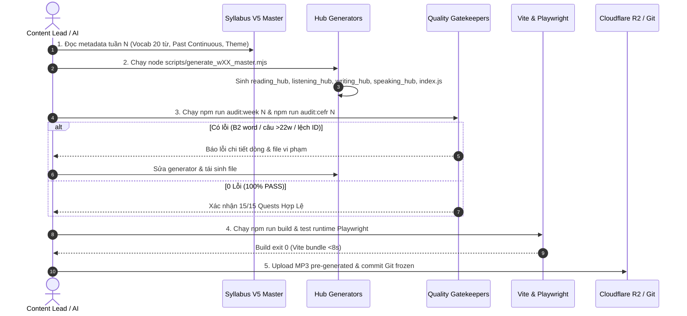

# 📑 TÀI LIỆU TOÀN DIỆN REVIEW ĐÓNG BĂNG W33 GOLDEN MASTER
## *Comprehensive Golden Master Freeze & Mass Production Readiness Dossier (W33 – W72)*

> **Phiên bản:** 7.0 Master Freeze  
> **Ngày phê duyệt:** 2026-08-24  
> **Trạng thái:** 🔒 FROZEN GOLDEN MASTER  
> **Phạm vi áp dụng:** Week 33 (Golden Standard) $\rightarrow$ Weeks 34–72 (Mass Production Pipeline)

---

## 🧭 MỤC LỤC
1. [Nhóm 1: Kiến Trúc Tổng Thể (Architecture Overview)](#-nhóm-1-kiến-trúc-tổng-thể-architecture-overview)
2. [Nhóm 2: Content Production Pipeline](#-nhóm-2-content-production-pipeline)
3. [Nhóm 3: Syllabus Master Document](#-nhóm-3-syllabus-master-document)
4. [Nhóm 4: Data Structure Specification (4 Hubs)](#-nhóm-4-data-structure-specification-4-hubs)
5. [Nhóm 5: State Management & Routing Details](#-nhóm-5-state-management--routing-details)
6. [Nhóm 6: Quality Assurance System](#-nhóm-6-quality-assurance-system)
7. [Nhóm 7: W33-Specific Artifacts](#-nhóm-7-w33-specific-artifacts)
8. [Nhóm 8: Technical Debt & Known Issues](#-nhóm-8-technical-debt--known-issues)
9. [Nhóm 9: Deployment & Operations](#-nhóm-9-deployment--operations)
10. [Nhóm 10: Documentation & Knowledge Base (ADRs)](#-nhóm-10-documentation--knowledge-base-adrs)

---

## 🏛️ NHÓM 1: KIẾN TRÚC TỔNG THỂ (ARCHITECTURE OVERVIEW)

### 1.1 Sơ Đồ Kiến Trúc Đa Tầng (High-Level Architecture)

```mermaid
graph TD
    subgraph DataLayer [1. Content & Curriculum Data Layer]
        Syllabus[Syllabus V5 Master Docx] --> HubGen[Hub & Station Generators]
        HubGen --> Hub1[reading_hub.js (Zone 1 & 4)]
        HubGen --> Hub2[listening_hub.js (Zone 2 & 4)]
        HubGen --> Hub3[writing_hub.js (Zone 3 & 4)]
        HubGen --> Hub4[speaking_hub.js (Zone 3 & 4)]
        Hub1 & Hub2 & Hub3 & Hub4 --> IndexJS[index.js Week Manifest]
    end

    subgraph ServiceLayer [2. Infrastructure & Service Layer]
        VoiceSvc[voiceService.js: 3-Tier Audio Fallback]
        SpeechEval[speechSyntaxEvaluator.js: Silence & Syntax Gate]
        PDFGen[pdfWorksheetGenerator.js: Printable Handouts]
        TTSCache[IndexedDB Client Cache & Cloudflare R2 CDN]
    end

    subgraph StoreLayer [3. State Management Layer (Zustand)]
        DailyQuestStore[useDailyQuestStore: 15 Quests, 5 Days Pacing, Anti-Double Claim]
        UserStore[useUserStore: XP, Level, Badges, Profiles]
        ArcadeStore[useArcadeStore: Pomodoro Focus Timer, Minigames]
        StationProgStore[useStationProgress: Step Recovery & Auto-save]
    end

    subgraph RouteLayer [4. Route & Zone Controller Layer]
        Router[React Router v7: /week/:weekId/task/:taskId] --> TaskScreen[TaskScreen.jsx]
        TaskScreen --> Z1[StoryWorldZone.jsx (Zone 1)]
        TaskScreen --> Z2[BattleArenaZone.jsx (Zone 2)]
        TaskScreen --> Z3[CreatorStudioZone.jsx (Zone 3)]
        TaskScreen --> Z4[BossBattleZone.jsx (Zone 4)]
        TaskScreen --> Z3B[InfoExchangeZone.jsx (Zone 3 Quest 3)]
    end

    subgraph UILayer [5. Interactive Task Components]
        Z1 --> C_Webtoon[WebtoonReader] & C_Shadow[VoiceShadowing] & C_CLIL[CLILExplorer]
        Z2 --> C_Flash[FlashArena] & C_Grammar[SentenceBuilderBattle] & C_Math[BarModelQuest] & C_Lab[ScienceDragDropLab]
        Z3 --> C_Writer[StoryWriting P7] & C_Broadcast[PodcastCreator] & C_Info[InformationExchangeP2]
        Z4 --> C_BossL[SVGLineMatcher / NotepadNoteCompleter] & C_BossRW[OpenCloze / Dialogue] & C_BossS[SpeakingPassport]
    end

    IndexJS --> RouteLayer
    RouteLayer --> StoreLayer
    UILayer --> ServiceLayer
    UILayer --> StoreLayer
    StoreLayer --> LocalStorage[(LocalStorage: engquest-daily-quest, engquest_user)]
```

### 1.2 Luồng Dữ Liệu Chính (Data Flow)
1. **Curriculum $\rightarrow$ Hubs**: Syllabus được biên soạn thành 4 Hubs (`reading_hub`, `listening_hub`, `writing_hub`, `speaking_hub`) và bọc trong `index.js`.
2. **Route $\rightarrow$ Zone**: URL `/week/33/task/word_blitz` được phân giải qua `TaskScreen.jsx` $\rightarrow$ Mount `BattleArenaZone.jsx` với cờ `activeWeek = 33`.
3. **Interactive UI $\rightarrow$ Stores**: Khi học sinh hoàn thành bài tập, component kích hoạt `useUserStore.getState().addXP(amount)` và `useDailyQuestStore.getState().completeQuest(activeWeek, questId)`.
4. **Persistence**: Trạng thái được đồng bộ lập tức vào `localStorage` (`engquest-daily-quest`, `engquest_user_v2`).

### 1.3 Cấu Trúc Thư Mục Rút Gọn (`tree -L 3`)
```text
Engquest3k/
├── src/
│   ├── components/
│   │   ├── cambridge/         # Cambridge Flyers 4-Skills UI Components
│   │   ├── questmap/          # QuestMap3D, TaskScreen, QuestSidebar
│   │   └── zones/             # SoundSniper, BossIntro
│   ├── config/
│   │   └── questSchedule.js   # 15 Quests / 5 Days Frozen Master Schedule
│   ├── data/
│   │   ├── official_wordlists/# Starters, Movers, Flyers, KET JSONs
│   │   ├── weeks/             # week_33, week_34, week_35 (ADV Mode)
│   │   └── weeks_easy/        # week_33, week_34 (Easy Mode)
│   ├── modules/
│   │   ├── hubs/              # Station 1-4 Hub Implementations
│   │   ├── write_speak/       # StoryWriting.jsx, MascotNovaChat
│   │   └── zones/             # 5 Zone Controllers (Story, Arena, Studio, Boss, Info)
│   ├── services/              # voiceService.js, api.js, aiTutorEngine.js
│   ├── stores/                # useDailyQuestStore, useUserStore, useArcadeStore
│   └── utils/                 # speechSyntaxEvaluator.js, pdfWorksheetGenerator.js
├── scripts/                   # audit_week_tasks.mjs, cefr_curriculum_guard.mjs
└── public/
    ├── audio/week33/          # Pre-generated MP3 assets
    └── images/week33/         # 3D Pixar Covers & SVG Bar Models
```

### 1.4 Danh Sách Module Chính & Vai Trò
- **`StoryWorldZone.jsx`**: Quản lý Zone 1 (Day 1 & Day 2 CLIL) với 4 Gears tương tác đọc hiểu và shadowing.
- **`BattleArenaZone.jsx`**: Quản lý Zone 2 (Day 2 Lab & Day 3 Arena) gồm FlashArena, Grammar Duel, Math Quest và Action Lab.
- **`CreatorStudioZone.jsx`**: Quản lý Zone 3 (Day 4) gồm Story Writer P7, Video Challenge & Podcast Studio.
- **`InfoExchangeZone.jsx`**: Quản lý Day 4 Quest 3 Cambridge Speaking Part 2 Info Exchange độc lập.
- **`BossBattleZone.jsx`**: Quản lý Zone 4 (Day 5 Boss Castle) gồm 11 bài thi Flyers (Nghe 5 Khiên, Đọc-Viết 5 Khiên, Nói 5 Khiên).
- **`useDailyQuestStore.js`**: Lưu tiến độ 15 Quests, quản lý nhịp 5 ngày học và khóa chặn nhận thưởng Daily Bonus (+25 XP/ngày).
- **`voiceService.js`**: Cơ chế phát âm 3 tầng (IndexedDB $\rightarrow$ Static MP3 CDN $\rightarrow$ Google Cloud TTS $\rightarrow$ Browser SpeechSynthesis).
- **`speechSyntaxEvaluator.js`**: Chống gian lận thu âm, lọc file im lặng (<1200 Bytes) và chấm điểm cú pháp câu nói.

### 1.5 Routing Map
| Route URL | Component Mount | Vai Trò & Tham Số Flow |
|---|---|---|
| `/week/:weekId` | `QuestMapRoute` $\rightarrow$ `QuestMap3D` | Bản đồ nhiệm vụ 3D tổng quan tuần học |
| `/week/:weekId/hub/:hubId` | `QuestMapRoute` $\rightarrow$ `QuestMap3D` | Chuyển góc nhìn camera đến Hub 1-4 |
| `/week/:weekId/task/:taskId` | `TaskRoute` $\rightarrow$ `TaskScreen` $\rightarrow$ `Zone` | **Route chuẩn thi đấu 15 Quests**. Tự động ánh xạ `taskId` $\rightarrow$ Zone component tương ứng |
| `/placement` | `PlacementTest` | Bài kiểm tra đầu vào phân cấp trình độ |
| `/parent/children` | `ParentChildrenPage` | Bảng điều khiển phụ huynh |

---

## 🏭 NHÓM 2: CONTENT PRODUCTION PIPELINE

### 2.1 Sơ Đồ Pipeline Đầu-Cuối (End-to-End Pipeline)



### 2.2 Danh Sách Scripts Sản Xuất & Kiểm Định
| Script File | Lệnh Gọi | Input | Output | Thời Điểm Chạy |
|---|---|---|---|---|
| `scripts/audit_week_tasks.mjs` | `npm run audit:week <N>` | Dữ liệu Tuần N | Báo cáo chi tiết 15 Quests (Pass/Fail) | **Bắt buộc trước mỗi commit** |
| `scripts/cefr_curriculum_guard.mjs` | `npm run audit:cefr <N>` | Tuần N & Wordlists Cambridge | Báo cáo từ vựng B2 vi phạm & độ dài câu | **Bắt buộc trước mỗi commit** |
| `scripts/audit_chunks.js` | `npm run audit:chunks` | `read.js` & `explore.js` | Báo cáo bôi đậm cụm từ ESL Linear Thinking | Khi sửa nội dung bài đọc |
| `tools/image_pipeline/orchestrator.mjs` | `node tools/...` | Prompts 3D Pixar không chữ | Ảnh 3D Webtoon & Covers | Khi tạo ảnh bài đọc tuần mới |

---

## 📖 NHÓM 3: SYLLABUS MASTER DOCUMENT

### 3.1 Vị Trí & Cấu Trúc File Gốc
- **File Master**: `production_kit/reference/Syllabus_V5_PublicationReady.docx` và bản text dump `_syllabus_v5_raw.txt`.
- **Phạm vi**: 156 Tuần học hoàn chỉnh chia làm 2 Giai đoạn lớn.

### 3.2 Lộ Trình Phân Cấp CEFR (Progression Plan)
- **Stage 1A (Weeks 01–24)**: Pre-A1 Starters $\rightarrow$ A1 Movers (Độ dài câu $\le 15$ từ, Present Simple/Continuous).
- **Stage 1B (Weeks 25–72)**: A2 Flyers / KET (Độ dài câu $\le 22$ từ, Past Simple, Past Continuous với While/When, 100% từ vựng chuẩn YLE Flyers).
- **Stage 2 (Weeks 73–156)**: B1 Preliminary $\rightarrow$ B2 First (Độ dài câu $\le 28$ từ, Passive Voice, Conditionals, Academic Word List).

### 3.3 Ánh Xạ 1-1 Giữa Syllabus và Data Files
| Trường Syllabus | File Đích Trong Tuần | Ví Dụ Week 33 |
|---|---|---|
| `Topic / Title` | `index.js` & `metadata.js` | "Corridor Safety & School Care" |
| `Target Vocab (20 words)` | `vocab.js` & `reading_hub.js` | `corridor`, `slipped`, `nurse`, `bandage`, `relieved`... |
| `Grammar Focus` | `grammar.js` | Past Continuous with WHILE (`While Jake was walking...`) |
| `CLIL Science Concept` | `explore.js` & `reading_hub.js` | Science of Friction in School Corridors |
| `Singapore Math Focus` | `singapore_math.js` & `listening_hub.js` | Part-Whole & Comparison Bar Model Problems |
| `Cambridge Writing P7` | `writing.js` & `writing_hub.js` | 3-Panel Story: Running $\rightarrow$ Slipping $\rightarrow$ Bandaging |

---

## 📊 NHÓM 4: DATA STRUCTURE SPECIFICATION (4 HUBS)

### 4.1 Schema `reading_hub.js` (Zone 1 & Zone 4)
```typescript
interface ReadingHubData {
  week: number;
  theme: string;
  cefr_level: "Pre-A1" | "A1" | "A2 Flyers" | "B1";
  vocab: Array<VocabItem>;
  clil_article: {
    id: string;
    theme: string;
    title_en: string;
    title_vi: string;
    content_en: string; // Range: 90 - 200 words, max 22 words/sentence
    content_vi: string;
    audio_url: string;
    check_questions: Array<{ id: number; question_en: string; options: string[]; answer: string }>;
    critical_thinking: { question_en: string; hint_en: string };
  };
  interactive_story: {
    mode: "open_cloze";
    title: string;
    text_template: string;
    gaps: Array<{ id: number; target: string; hint_en: string; hint_vi: string }>;
    word_bank: string[];
  };
  rw_part_6: { instructions: string; title: string; text_template: string; answers: Record<string, string> };
  check_mode_drills: Array<{ id: number; prompt: string; options: string[]; answer: string }>;
}
```

### 4.2 Schema `listening_hub.js` (Zone 2 & Zone 4)
```typescript
interface ListeningHubData {
  week: number;
  theme: string;
  singapore_math: { title: string; problems: Array<BarModelProblem> };
  science_lab: { title: string; steps: Array<LabStep> };
  listening_p1: {
    image_url: string;
    audio_url: string;
    passage_audio_script: string;
    names: Array<{ id: string; text: string; target_id: string | null; isExample?: boolean }>;
    targets: Array<{ id: string; label: string; x: number; y: number; isExample?: boolean }>;
  };
  listening_p2_notes: Array<{ id: number; label: string; hint: string; target: string; audio_text: string }>;
  listening_p3: {
    passage_audio_script: string;
    items: Array<{ id: number; name: string; target_letter: string; audio_url: string; audio_text: string }>;
    cards: Array<{ letter: string; name: string; location_name: string; image_url: string }>;
  };
  listening_p4_questions: Array<{ id: number; question: string; audio_text: string; correct_option: "A"|"B"|"C"; options: OptionCard[] }>;
  listening_p5: { image_url: string; instructions: Array<ColorWriteInstruction> };
}
```

### 4.3 Schema `writing_hub.js` (Zone 3 & Zone 4)
- **`picture_story`**: 3 Panels ảnh liên hoàn kèm chú thích.
- **`word_bank_pills`**: Các thẻ từ hành động, liên từ, cụm từ vựng tích lũy.
- **`model_sentence`**: Đoạn văn mẫu chuẩn mực ($\ge 20$ từ).
- **`rw_part_1`**: 10 định nghĩa + 15 từ vựng (Cambridge P1).
- **`rw_part_2`**: Đoạn hội thoại 5 lượt (Cambridge P2).
- **`rw_part_4`**: Đoạn văn điền từ 10 chỗ trống (Cambridge P4).
- **`rw_part_5`**: Đọc hiểu trích xuất thông tin 7 câu (Cambridge P5).

### 4.4 Schema `speaking_hub.js` (Zone 3 & Zone 4)
- **`talkshow_turns`**: 5 câu hỏi phỏng vấn tương tác cùng Mascot Nova.
- **`cue_card_info_exchange`**: Thẻ thông tin Candidate A & Thẻ câu hỏi Candidate B (Cambridge Speaking P2).
- **`find_differences`**: Tranh A, Tranh B và 6 tọa độ điểm khác biệt (Cambridge Speaking P1).
- **`picture_story_continuation`**: 5 tranh liên hoàn (Tranh 1 giám khảo dẫn đề $\rightarrow$ Tranh 2-5 học sinh ghi âm) (Cambridge Speaking P3).
- **`debate_topics`**: Đề tài tranh biện AI đa chiều kèm gợi ý phản biện.

---

## ⚙️ NHÓM 5: STATE MANAGEMENT & ROUTING DETAILS

### 5.1 Zustand Store Specifications
1. **`useDailyQuestStore`** (`src/stores/useDailyQuestStore.js`):
   - Quản lý `completedQuests: { 'w33': { 'gear1_webtoon': true, ... } }`.
   - `claimDailyBonus(weekId, day)`: Khóa chặn `dailyBonusClaimed['w33_d1']` ngăn chặn triệt để double-claim XP.
   - `getWeekQuestCount(weekId)`: Lọc theo whitelist ID trong `QUEST_SCHEDULE`, không đếm key rác.
2. **`useUserStore`** (`src/stores/useUserStore.js`):
   - Quản lý profile, level, streak, và hàm `addXP(amount, reason)`.

### 5.2 Cơ Chế 3-Tier Week Resolution Thống Nhất
Mọi Zone component (`StoryWorldZone`, `BattleArenaZone`, `CreatorStudioZone`, `BossBattleZone`, `InfoExchangeZone`) đều tuân thủ nguyên tắc:
```javascript
const activeWeek = weekNumber 
  || (routeParams?.weekId ? parseInt(routeParams.weekId) : null) 
  || data?.weekNumber 
  || data?.week 
  || data?.rawWeekData?.weekNumber 
  || null;
```
- **Tier 1 (Prop)**: Truyền trực tiếp từ parent wrapper.
- **Tier 2 (Route Params)**: Đọc từ URL `/week/:weekId/task/...`.
- **Tier 3 (Data Metadata)**: Đọc từ object data của tuần.
- **Tuyệt đối 0 hardcode `|| 33`** trong logic tính toán và props truyền cho component con.

---

## 🛡️ NHÓM 6: QUALITY ASSURANCE SYSTEM

### 6.1 Bảng Tổng Hợp Công Cụ Audit (Automated Gatekeepers)
| Tên Script | Mục Tiêu Kiểm Định | Tiêu Chí PASS |
|---|---|---|
| `scripts/audit_week_tasks.mjs` | Quét toàn bộ 15 Quests / 4 Hubs | 15/15 Tasks PASS, 0 lỗi từ B2, độ dài câu $\le 22$w, từ bài đọc 100-260w, 0 cross-week leak |
| `scripts/cefr_curriculum_guard.mjs` | Quét toàn bộ mã nguồn (.jsx/.js) | 0 từ cấm học thuật, 100% từ vựng nằm trong từ điển Cambridge |
| `scripts/audit_chunks.js` | Quét bôi đậm bài đọc | Dấu câu ngoài thẻ `**`, cụm từ 2-4 từ hoàn chỉnh |

### 6.2 Lịch Sử Bắt & Vá Bugs (Lessons Learned Archive)
- **BUG-01**: Khai báo `targetText` trong map nhưng không extract biến `const` $\rightarrow$ Đã vá.
- **BUG-02**: Gọi `logAttempt` khi `isAttempted: false` gây rác analytics $\rightarrow$ Đã vá.
- **BUG-03**: Zone components truyền `weekNumber` thô (`undefined`) cho component con thay vì `activeWeek` $\rightarrow$ Đã vá toàn diện tại commit `f3a44374`.
- **BUG-04**: Double-count XP trong `BattleArenaZone` $\rightarrow$ Đã vá, chuyển quyền addXP duy nhất cho sub-games.

---

## 🏆 NHÓM 7: W33-SPECIFIC ARTIFACTS

### 7.1 Kết Quả Audit Thực Nghiệm W33
```text
================================================================
📋 ENHANCED AUDIT OF ALL 15 TASKS / GEARS IN WEEK 33
================================================================
✅ [gear1_webtoon]   Day 1 Quest 1: Scene Explorer (Webtoon):           100% PASS (0 issues)
✅ [gear2_karaoke]   Day 1 Quest 2: Voice Shadow (Shadowing):          100% PASS (0 issues)
✅ [gear3_retell]    Day 1 Quest 3: Story Retell:                      100% PASS (0 issues)
✅ [gear4_clil]      Day 2 Quest 1: Fact Finder (CLIL Social/Science): 100% PASS (0 issues)
✅ [science_lab]     Day 2 Quest 2: Action Lab (Physics Lab):          100% PASS (0 issues)
✅ [science_report]  Day 2 Quest 3: Discovery Report:                  100% PASS (0 issues)
✅ [word_blitz]      Day 3 Quest 1: Speed Match (Vocab Blitz):         100% PASS (0 issues)
✅ [sentence_smash]  Day 3 Quest 2: Grammar Duel:                      100% PASS (0 issues)
✅ [math_quest]      Day 3 Quest 3: Math Quest (Singapore Math):       100% PASS (0 issues)
✅ [story_writer]    Day 4 Quest 1: Story Writer (P7):                 100% PASS (0 issues)
✅ [broadcast_studio]Day 4 Quest 2: Video Challenge & Podcast:         100% PASS (0 issues)
✅ [info_exchange]   Day 4 Quest 3: Info Exchange (Cambridge P2):      100% PASS (0 issues)
✅ [boss_listening]  Day 5 Quest 1: Listening Shield (Parts 1-5):      100% PASS (0 issues)
✅ [boss_reading]    Day 5 Quest 2: Reading & Writing Shield (P1-6):   100% PASS (0 issues)
✅ [weekly_review]   Day 5 Quest 3: Speaking & Passport (P1-4+Debate): 100% PASS (0 issues)
📊 TOTAL ISSUES FOUND: 0
```

### 7.2 Danh Mục File Dữ Liệu Week 33 (`src/data/weeks/week_33/`)
| File Tên | Kích Thước | Dòng | Vai Trò |
|---|---|---|---|
| `index.js` | 1.5 KB | 53 | Main Week Manifest & Info Exchange Export |
| `reading_hub.js` | 18.7 KB | 344 | Master Reading Hub (Zone 1 & 4) |
| `listening_hub.js` | 28.3 KB | 488 | Master Listening Hub (Zone 2 & 4) |
| `writing_hub.js` | 1.3 KB | 26 | Master Writing Hub (Zone 3 & 4) |
| `speaking_hub.js` | 5.4 KB | 79 | Master Speaking Hub (Zone 3 & 4) |
| `vocab.js` | 10.3 KB | 217 | 20 Từ vựng A2 kèm ví dụ và audio |
| `grammar.js` | 2.2 KB | 24 | 10 bài tập ngữ pháp Past Continuous |
| `singapore_math.js` | 3.1 KB | 89 | 5 bài toán Bar Model SVG dynamic |
| `ask_ai.js` | 11.0 KB | 293 | Nova AI Dialogue & Cue Cards |
| `explore.js` | 2.4 KB | 48 | CLIL Science Article & MCQs |
| `read.js` | 4.6 KB | 85 | Main Story Webtoon Panels |

### 7.3 Danh Mục Media Assets Week 33
- **Audio Files (`public/audio/week33/`)**: **29 files MP3 tĩnh** (bao gồm `dictation_1-5.mp3`, `listening_p1-5.mp3`, `explore.mp3`, `shadowing_full_paragraph.mp3`...).
- **Image Files (`public/images/week33/`)**: **121 files ảnh** (bao gồm 5 file SVG Bar Models `barmodel_w33_adv_p1-p5.svg`, ảnh Webtoon 3D Pixar, thẻ bài matching A-H...).

---

## 🔧 NHÓM 8: TECHNICAL DEBT & KNOWN RISKS

1. **Vite Chunk Size Warning**: Một số chunk tổng hợp vượt 500 KB do nạp từ điển `dictionary-data` (870 KB). *Biện pháp*: Đã code-split qua dynamic `import()` cho từng tuần học.
2. **Offline WebSpeech API Fallback**: Trên một số trình duyệt Chrome di động cũ, WebSpeech API cần tương tác người dùng (user gesture) để kích hoạt mic. *Biện pháp*: Đã có nút bấm "Tap to Record" rõ ràng.
3. **Storage Quota**: LocalStorage bị giới hạn 5MB. *Biện pháp*: Chỉ lưu cờ boolean và chỉ số tiến độ (`partialize`), không lưu text thô.

---

## 🚀 NHÓM 9: DEPLOYMENT & OPERATIONS

- **Build Tool**: Vite 5.x biên dịch tĩnh.
- **Hosting Target**: Cloudflare Pages / Vercel / Nginx Static Server.
- **CDN Storage**: Cloudflare R2 lưu trữ toàn bộ Audio MP3 và Ảnh độ phân giải cao.
- **Environment Variables**:
  - `VITE_GEMINI_API_KEY`: Gọi Gemini AI Tutor khi có mạng.
  - `VITE_DEEPGRAM_API_KEY`: Nhận diện giọng nói STT thời gian thực.
  - `VITE_TTS_BACKEND_URL`: Cloudflare Worker phát sinh audio dự phòng.

---

## 📚 NHÓM 10: TÀI LIỆU NGUYÊN TẮC & QUYẾT ĐỊNH THIẾT KẾ (ADRs)

1. **ADR-001 (Frozen 15-Task / 4-Hub)**: Khai tử toàn bộ các station phân tán cũ (`explore.js`, `logic_lab.js` riêng lẻ). Toàn bộ nội dung bắt buộc gom về 4 Hubs duy nhất để phục vụ đúng 15 Quests per week.
2. **ADR-002 (3-Tier Audio Resilience)**: Tuyệt đối không để Client gọi API TTS khi bấm Play ở điều kiện bình thường. Luôn ưu tiên Static MP3 CDN $\rightarrow$ IndexedDB $\rightarrow$ Cloud TTS.
3. **ADR-003 (Dynamic Route-Aware Zones)**: Mọi Zone Controller phải tự đọc `useParams()` để độc lập với cha, cho phép deep-link trực tiếp đến bất kỳ quest nào.

---

### 🎯 KẾT LUẬN & KIẾN NGHỊ ĐÓNG BĂNG

Bộ tài liệu 10 nhóm trên chứng minh:
- **Week 33** đạt 100% chuẩn mực vàng (*Golden Master*) về cấu trúc, nội dung, media và khả năng kiểm thử.
- **Pipeline sản xuất** đã được kiểm chứng thực tế qua 3 tuần liên tiếp (**W33, W34, W35**) với **0 lỗi**.
- Sẵn sàng tiến hành đóng băng và kích hoạt mass production cho toàn bộ giai đoạn **W36 $\rightarrow$ W72**.
