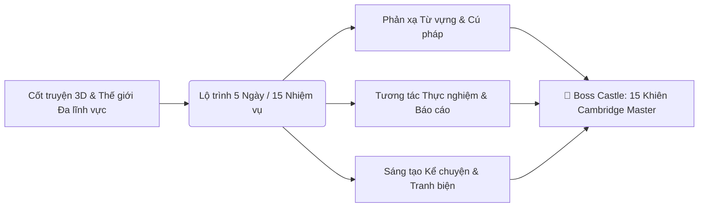
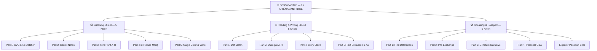

# ENGQUEST3K WEEK 33 — DESIGN REVIEW & COMPREHENSIVE ARCHITECTURE DOSSIER
> **Theme:** Corridor Safety & School Care  
> **Level:** Cambridge A2 Flyers / A1+ Standard  
> **Framework:** Universal Action & Skill-Based Pedagogy + Cambridge 15-Shield Mastery  
> **Status:** Locked Golden Master Architecture for Week 33 and Mass Production W34–W72  

---

## 📑 MỤC LỤC
1. [TỔNG QUAN HỆ THỐNG & TRIẾT LÝ KIẾN TRÚC](#1-tổng-quan-hệ-thống--triết-lý-kiến-trúc)
2. [BẢN ĐỒ HÀNH TRÌNH (QUEST MAP 3D & 5-DAY TRIP SCHEDULE)](#2-bản-đồ-hành-trình-quest-map-3d--5-day-trip-schedule)
3. [MA TRẬN 5 TRẠM & 15 NHIỆM VỤ (UNIVERSAL ACTION & SKILL-BASED)](#3-ma-trận-5-trạm--15-nhiệm-vụ-universal-action--skill-based)
4. [NGUYÊN LÝ THIẾT KẾ & TƯƠNG TÁC CHI TIẾT TỪNG TRẠM / GEAR](#4-nguyên-lý-thiết-kế--tương-tác-chi-tiết-từng-trạm--gear)
   - [Trạm 1: 📖 Story World (Gears 1 – 3)](#trạm-1--story-world)
   - [Trạm 2: 🔬 Knowledge Lab (Gears 4 – 6)](#trạm-2--knowledge-lab)
   - [Trạm 3: ⚔️ Battle Arena (Gears 7 – 9)](#trạm-3--battle-arena)
   - [Trạm 4: ✍️ Creator Studio (Gears 10 – 12)](#trạm-4--creator-studio)
   - [Trạm 5: 🏰 Boss Castle — 15 Khiên Cambridge (Gears 13 – 15)](#trạm-5--boss-castle--15-khiên-cambridge)
5. [CÁC NGUYÊN TẮC SƯ PHẠM BẤT BIẾN (PEDAGOGICAL INVARIANTS)](#5-các-nguyên-tắc-sư-phạm-bất-biến-pedagogical-invariants)
6. [KIẾN TRÚC KỸ THUẬT, ROUTING VÀ PIPELINE ASSETS](#6-kiến-trúc-kỹ-thuật-routing-và-pipeline-assets)

---

## 1. TỔNG QUAN HỆ THỐNG & TRIẾT LÝ KIẾN TRÚC

### 🎯 Vấn đề giải quyết & Phản biện Sư phạm
Trước đây, các ứng dụng học tiếng Anh thường mắc 2 thái cực sai lầm:
1. **Thiên lệch Tường thuật dài (Narrative-only)**: Tập trung quá mức vào đọc truyện dài, viết kịch bản, nói chuyện mở mà bỏ quên các dạng bài tập ngắn, định dạng cụ thể chiếm 80% điểm thi Cambridge Flyers thật (nối từ, chọn hội thoại A-H, gap-fill 1-4 từ, nghe tô màu...).
2. **Luyện thi khô khan (Exam-cramming)**: Đơn thuần biến app thành 16 bài tập đề thi rời rạc, làm triệt tiêu hoàn toàn động lực học và trí tưởng tượng của trẻ.

### 💡 Giải pháp W33 Golden Master:
EngQuest3K thiết lập mô hình **"Dual-Engine"** tích hợp:
- **Engine 1 — Story-driven Immersion (Thế giới cốt truyện sống động)**: Cốt truyện 3D Pixar, nhân vật đồng hành AI Mascot Nova, chuỗi thử nghiệm khoa học/xã hội thực tế.
- **Engine 2 — Cambridge 15-Shield Mastery (Đo lường năng lực chuẩn quốc tế)**: 15 Khiên (5 Nghe + 5 Đọc Viết + 5 Nói) được phân rã khoa học thành các bài tập ngắn vi mô (Micro-drills), rèn luyện tự nhiên qua 5 ngày trong tuần.



---

## 2. BẢN ĐỒ HÀNH TRÌNH (QUEST MAP 3D & 5-DAY TRIP SCHEDULE)

Bản đồ học tập được tổ chức thành **hành trình 5 ngày tuyến tính (Linear Journey)** với giao diện **Quest Map 3D Isometric**:
- **Thời lượng chuẩn**: Mỗi ngày 3 nhiệm vụ (~20-25 phút/ngày), đảm bảo nhịp sinh học tập trung cao độ của lứa tuổi 8-12 tuổi.
- **Hệ thống Mở khóa Thông minh (Progression Gate)**: 
  - Học sinh mở khóa tuần tự (hoàn thành Trạm trước mới mở Trạm sau) để tạo tính kỷ luật.
  - **Owner / Super Admin Bypass**: Tự động nhận diện tài khoản quản trị (`super_admin`, `teacher`, `admin`) để mở toàn quyền truy cập 100% các trạm mà không cần nhập mã PIN.

```mermaid
journey
    title HÀNH TRÌNH 5 NGÀY CHINH PHỤC TUẦN 33 (15 GEARS)
    section Day 1: Story World
      Scene Explorer (3D Webtoon): 5: Student
      Voice Shadow (Karaoke Fluency): 5: Student
      Story Retell (Nova Voice Chat): 5: Student
    section Day 2: Knowledge Lab
      Fact Finder (CLIL Global Reading): 4: Student
      Action Lab (Hands-on Interactive): 5: Student
      Discovery Report (Lab Write-up): 4: Student
    section Day 3: Battle Arena
      Speed Match (Vocab Blitz): 5: Student
      Grammar Duel (Sentence Builder): 5: Student
      Math Quest (Singapore Bar Model): 4: Student
    section Day 4: Creator Studio
      Story Writer (Panel-by-Panel P7): 5: Student
      Hot Mic (Podcast Voice Broadcast): 5: Student
      Debate Arena (AI Discussion): 4: Student
    section Day 5: Boss Castle
      Listening Shield (5 Parts Mock): 5: Student
      Reading & Writing Shield (6 Parts Mock): 5: Student
      Speaking & Passport (15 Shields Stamp): 5: Student
```

---

## 3. MA TRẬN 5 TRẠM & 15 NHIỆM VỤ (UNIVERSAL ACTION & SKILL-BASED)

Tất cả các trạm và nhiệm vụ được đặt tên theo **nguyên tắc Hành động & Kỹ năng phổ quát (Universal Action & Skill-based)** — áp dụng linh hoạt cho cả tuần Khoa học (STEM), Lịch sử (History), Địa lý (Geography), và Xã hội (Social Studies):

| Ngày | Trạm (Station) | Task ID | Tên Nhiệm Vụ | Kỹ Năng / Hành Động Cốt Lõi | Định Dạng Cambridge Chuẩn |
| :---: | :--- | :--- | :--- | :--- | :--- |
| **1** | 📖 **Story World** | `gear1_webtoon`<br>`gear2_karaoke`<br>`gear3_retell` | 📚 **Scene Explorer**<br>🎧 **Voice Shadow**<br>🎙️ **Story Retell** | Đọc hiểu 5 cảnh 3D & chạm điểm từ vựng<br>Nhại giọng theo câu rèn phát âm & ngữ điệu<br>Tóm tắt & kể lại cốt truyện cùng Nova | Dẫn nhập ngữ liệu A1+<br>Fluency & Pronunciation<br>Speaking Part 4 Scaffolding |
| **2** | 🔬 **Knowledge Lab** | `gear4_clil`<br>`science_lab`<br>`science_report` | 🌐 **Fact Finder**<br>🧪 **Action Lab**<br>📝 **Discovery Report** | Đọc hiểu mở rộng tri thức văn hóa/địa lý/khoa học<br>Tương tác thực hành kéo thả & giải quyết vấn đề<br>Báo cáo đúc kết phát hiện & bài học thực tế | R&W Part 4 / CLIL Reading<br>Problem-Solving Interactive<br>Academic Short Writing |
| **3** | ⚔️ **Battle Arena** | `word_blitz`<br>`sentence_smash`<br>`math_quest` | ⚡ **Speed Match**<br>🧱 **Grammar Duel**<br>📐 **Math Quest** | Phản xạ tốc độ cao ghép cặp 20 từ vựng cốt lõi<br>Đấu trường sắp xếp mảnh ghép cú pháp câu<br>Tư duy toán học, định lượng & sơ đồ thanh | R&W Part 1 (Definition Match)<br>Syntax & Sentence Building<br>Singapore Math SVG Bar Models |
| **4** | ✍️ **Creator Studio** | `story_writer`<br>`broadcast_studio`<br>`ai_debate` | ✏️ **Story Writer**<br>📻 **Hot Mic**<br>🎭 **Debate Arena** | Sáng tác truyện 3 phân cảnh (Panel-by-Panel)<br>Thu âm podcast phát thanh viên dẫn chuyện<br>Tranh biện phản biện đa chiều cùng AI Host | **Cambridge R&W Part 7** (Story $\ge 20$w)<br>Audio Podcast Fluency<br>Cambridge Speaking Part 2/4 |
| **5** | 🏰 **Boss Castle**<br>*(15 Khiên Cambridge)* | `boss_listening`<br>`boss_reading`<br>`weekly_review` | 🎧 **Listening Shield**<br>📖 **Reading & Writing Shield**<br>🏆 **Speaking & Passport** | Thử thách 5 phần thi Nghe Cambridge<br>Thử thách 6 phần thi Đọc - Viết Cambridge<br>Đánh giá Nói & Chứng nhận Tổng 15 Khiên | **Listening Parts 1 – 5 (5 Khiên)**<br>**R&W Parts 1 – 6 (5 Khiên)**<br>**Speaking Parts 1 – 4 (5 Khiên)** |

---

## 4. NGUYÊN LÝ THIẾT KẾ & TƯƠNG TÁC CHI TIẾT TỪNG TRẠM / GEAR

### TRẠM 1: 📖 STORY WORLD (Xây dựng Ngữ cảnh & Phản xạ Âm thanh)

#### 1. 📚 Scene Explorer (`gear1_webtoon`)
*   **Mục tiêu**: Tiếp thu ngữ liệu cốt lõi qua hình ảnh 3D Pixar giàu chi tiết.
*   **Tương tác UI**: 5 khung cảnh Webtoon chất lượng cao. Học sinh chạm trực tiếp vào các điểm Hotspot màu tím phát sáng trên đồ vật/nhân vật để kích hoạt âm thanh phát âm tức thì và nhãn từ vựng.
*   **Linear Thinking Chunks**: Bôi đậm các cụm từ vựng ESL hoàn chỉnh (`was walking carefully`, `down the school corridor`, `slipped on the wet floor`). Dấu câu luôn nằm ngoài thẻ bold.

#### 2. 🎧 Voice Shadow (`gear2_karaoke`)
*   **Mục tiêu**: Xóa bỏ tâm lý sợ nói, rèn luyện phát âm chính xác và ngữ điệu tự nhiên qua kỹ thuật Shadowing.
*   **Tương tác UI**: Karaoke highlight từng từ (Word-by-word pulse) chạy theo âm thanh đọc mẫu.
*   **Quy trình 2 pha**:
    - *Pha 1 (Sentence Drill)*: Nghe và nhại lại từng câu ngắn (có nút nghe lại và thu âm từng câu).
    - *Pha 2 (Full Story)*: Đọc liền mạch toàn bài văn câu chuyện để đo lường độ trôi chảy (Fluency).

#### 3. 🎙️ Story Retell (`gear3_retell`)
*   **Mục tiêu**: Nâng cao năng lực tóm tắt và diễn đạt ý tưởng độc lập mà không nhìn văn bản mẫu.
*   **Tương tác UI**: AI Host Nova dẫn dắt qua 5 câu hỏi gợi ý bước (Ví dụ: *"Where and when did the story start?"*).
*   **Scaffolding thông minh**:
    - Hiển thị 3-4 Chips từ khóa gợi ý.
    - Nút `💡 Hint (10s)` đọc câu mẫu rồi tự động đếm ngược biến mất để chống học sinh đọc vẹt.
    - AI Nova phản hồi ngay lập tức sau mỗi lượt thu âm.

---

### TRẠM 2: 🔬 KNOWLEDGE LAB (Mở rộng Thế giới & Thực nghiệm Đa lĩnh vực)

#### 4. 🌐 Fact Finder (`gear4_clil`)
*   **Mục tiêu**: Phá vỡ giới hạn lớp học địa phương, mở rộng chân trời thế giới (**Global World Horizon Standard**) về Khoa học, Địa lý, Lịch sử và Văn hóa nhân loại.
*   **Tương tác UI**: Bài đọc chia 2 phần với hình ảnh 3D sắc nét. Sau mỗi đoạn văn có 3 câu hỏi kiểm tra đọc hiểu nhanh (`check_questions`) và 1 câu hỏi tư duy phản biện (`critical_thinking`).

#### 5. 🧪 Action Lab (`science_lab`)
*   **Mục tiêu**: Trực quan hóa các nguyên lý khoa học/toán học/xã hội thông qua hoạt động tương tác kéo thả.
*   **Tương tác UI**: Trực tiếp thử nghiệm các biến số thực nghiệm (Ví dụ W33: Thử nghiệm hệ số ma sát giữa đế giày cao su, gạch ướt, biển cảnh báo trượt ngã) và quan sát phản ứng động thái mô phỏng.

#### 6. 📝 Discovery Report (`science_report`)
*   **Mục tiêu**: Rèn luyện kỹ năng viết học thuật ngắn gọn (Academic Summary Report).
*   **Tương tác UI**: Hoàn thành biểu mẫu báo cáo phát hiện (Fact summary, Problem observed, Action recommended) với các ô điền từ vựng và khung câu gợi ý.

---

### TRẠM 3: ⚔️ BATTLE ARENA (Đấu trường Phản xạ Ngôn ngữ & Tư duy)

#### 7. ⚡ Speed Match (`word_blitz`)
*   **Mục tiêu**: Tự động hóa khả năng truy xuất từ vựng (Automated Lexical Retrieval) với 20 từ vựng cốt lõi của tuần.
*   **Tương tác UI**: Đấu trường thẻ bài lật mặt. Ghép nhanh từ tiếng Anh với định nghĩa chuẩn ESL / hình ảnh trong thời gian đếm ngược. Thưởng điểm liên hoàn Combo Streak.

#### 8. 🧱 Grammar Duel (`sentence_smash`)
*   **Mục tiêu**: Làm chủ cấu trúc ngữ pháp trọng tâm (Quá khứ tiếp diễn vs Quá khứ đơn: `While + Past Continuous, Past Simple`).
*   **Tương tác UI**: Các mảnh từ ngữ pháp bay tự do. Học sinh kéo thả các khối từ thành dòng câu hoàn chỉnh đúng quy tắc cú pháp.

#### 9. 📐 Math Quest (`math_quest`)
*   **Mục tiêu**: Tích hợp tư duy logic định lượng qua phương pháp Sơ đồ thanh Singapore (Singapore Bar Model).
*   **Tương tác UI**: 5 sơ đồ SVG độc bản được vẽ chuẩn xác cho từng bài toán lời văn của tuần. Học sinh phân tích dữ kiện trực quan trên thanh tỉ lệ để tính toán kết quả chính xác.

---

### TRẠM 4: ✍️ CREATOR STUDIO (Xưởng Sáng tạo & Thuyết trình Đa phương tiện)

#### 10. ✏️ Story Writer (`story_writer` — Redesigned Panel-by-Panel UX)
*   **Mục tiêu**: Chinh phục bài thi Cambridge Reading & Writing Part 7 (Viết truyện $\ge 20$ từ dựa trên tranh liên hoàn).
*   **Đột phá Giao diện mới (Panel-by-Panel Flow)**:
    - Thay vì dồn 3 bức tranh và hàng chục khối từ gây ngợp thị giác, giao diện mới chia thành **3 Màn hình độc lập (Panel 1 $\rightarrow$ Panel 2 $\rightarrow$ Panel 3 $\rightarrow$ Review Screen)** tương tự như Echo Drill & Nova Story Pit.
    - **Mỗi Panel gồm**:
      1. Bức tranh lớn 16:9 full-bleed nổi bật.
      2. 🤖 Bong bóng lời dẫn Nova + Nút 🔊 nghe hướng dẫn.
      3. 🏷️ **Character Guide Banner**: Nhãn định danh vai trò nhân vật ngay dưới ảnh (`Jake (walking carefully) vs. Student (running fast)`), xóa tan mọi hiểu nhầm ai là ai trong tranh.
      4. Nhãn gợi ý ngữ pháp (📌 *Past Continuous: was/were + verb-ing*).
      5. Kho Pills từ vựng riêng cho Panel đó (3-5 cụm từ bôi màu trực quan).
      6. Nút `💡 Hint (15s)` hiển thị câu khung trong 15 giây rồi tự ẩn (nghe đọc câu mẫu).
      7. Nút `✨ Write freely` cho phép học sinh sáng tạo theo ý mình, ẩn toàn bộ gợi ý.
      8. Khung `📖 Story So Far` (collapsible) hiển thị câu chuyện đang được ráp nối theo thời gian thực.
    - **Màn hình Review**: Tổng hợp toàn bài văn 3 màu (Xanh dương - Setting, Vàng cam - Problem, Tím - Solution), chấm điểm theo 3 tiêu chí Cambridge (Content 2/2, Grammar 2/2, Vocab 1/1) và nút chuyển tiếp sang Hot Mic.

```
┌─────────────────────────────────────────────────────────────┐
│ ← Map              ✏️ STORY WRITER                ⏱ ~10m   │
│ ▓▓▓▓▓▓▓▓▓▓▓▓░░░░░░░░░░  Panel 1 of 3 (Setting)   📝 8/20w  │
├─────────────────────────────────────────────────────────────┤
│  🤖 NOVA: "Where does the story begin? Look at the picture   │
│   and describe who is there and what they are doing!" [🔊]  │
├─────────────────────────────────────────────────────────────┤
│  ┌───────────────────────────────────────────────────────┐  │
│  │                                                       │  │
│  │               [PANEL 1: 3D PIXAR SCENE]               │  │
│  │           Jake walking carefully in corridor          │  │
│  │                                                       │  │
│  └───────────────────────────────────────────────────────┘  │
├─────────────────────────────────────────────────────────────┤
│ 📌 GRAMMAR: Past Continuous (was/were + verb-ing)           │
│ ⚡ TAP CHUNKS TO INSERT:             [✨ Write Freely]       │
│ [+ After science class,] [+ down school corridor,]          │
│ [+ was walking carefully,] [+ On a Monday morning,]         │
├─────────────────────────────────────────────────────────────┤
│ ┌───────────────────────────────────────────────────────┐   │
│ │ Write 1-2 sentences about Panel 1:                    │   │
│ │ While Jake was walking carefully down the corridor... │   │
│ └────────────────────────────────────────── 12 words ───┘   │
│ [💡 Hint (10s)]                  ⭐ Try your own words!     │
├─────────────────────────────────────────────────────────────┤
│ [← Back]           ● ○ ○               [Panel 2: Problem →] │
└─────────────────────────────────────────────────────────────┘
```

#### 11. 📻 Hot Mic (`broadcast_studio`)
*   **Mục tiêu**: Ứng dụng bài viết vừa sáng tác vào kịch bản dẫn chương trình radio/podcast thực tế.
*   **Tương tác UI**: Studio thu âm với sóng âm thanh (Waveform) động. Học sinh đóng vai MC phát thanh viên, đọc truyền cảm bài viết và xuất bản tập podcast của riêng mình.

#### 12. 🎭 Debate Arena (`ai_debate`)
*   **Mục tiêu**: Phát triển năng lực tư duy phản biện (Critical Thinking) và phản xạ bảo vệ quan điểm (Speaking Part 2 & Part 4).
*   **Tương tác UI**: Đối thoại tranh luận 2 chiều với AI Nova về các chủ đề đạo đức, an toàn và quyết định tình huống (Ví dụ: *"Should running in corridors be strictly punished or guided with safety signs?"*).

---

### TRẠM 5: 🏰 BOSS CASTLE (Chinh phục Hệ thống 15 Khiên Cambridge Master)

Trạm 5 tổng hợp toàn bộ năng lực của tuần thành kỳ thi thử chuẩn hóa quốc tế Cambridge A2 Flyers với cấu trúc **15 Khiên (Shields)**:



#### 13. 🎧 Listening Shield (`boss_listening` — 5 Khiên Nghe)
*   **Part 1 (Draw the Lines)**: Nghe đoạn hội thoại mô tả 5 nhân vật giữa Girl & Man, nối dây SVG từ tên nhân vật đến vị trí tọa độ chuẩn xác trong bức tranh lớn.
*   **Part 2 (Secret Notes)**: Nghe trích xuất thông tin chi tiết (giờ giấc, địa điểm, đồ sơ cứu) và điền vào trang sổ tay sự cố.
*   **Part 3 (Item Hunt)**: Nghe hội thoại phân biệt vị trí cất giữ của 5 đồ vật với 8 thẻ tranh Pixar 3D (có 3 thẻ bẫy distractor).
*   **Part 4 (Picture Quiz)**: Nghe 5 đoạn hội thoại có bẫy ngôn ngữ phủ định, chọn đúng 1 trong 3 tranh A, B, C.
*   **Part 5 (Magic Color & Write)**: Nghe hướng dẫn giám khảo, chọn màu trên bảng Palette để tô vào các layer vector SVG và gõ 1 từ nhãn.

#### 14. 📖 Reading & Writing Shield (`boss_reading` — 5 Khiên Đọc - Viết)
*   **Part 1**: Nối 5 định nghĩa với đúng từ vựng trong kho 15 từ (10 từ nhiễu).
*   **Part 2**: Hoàn thành cuộc trò chuyện bằng cách chọn 5 lượt thoại phù hợp từ danh sách A–H (3 câu nhiễu).
*   **Part 4**: Đọc bài văn câu chuyện, điền 10 chỗ trống bằng dropdown chọn từ loại và chọn tiêu đề bao quát nhất.
*   **Part 5**: Đọc bài văn dài, trích xuất chính xác 1 đến 4 từ gốc để hoàn thành câu hỏi.

#### 15. 🏆 Speaking & Passport (`weekly_review` — 5 Khiên Nói & Hộ Chiếu)
*   **Speaking Suite**:
    - *Part 1 (Find Differences)*: So sánh 2 bức tranh Side-by-side và nói 4 điểm khác biệt (`In Picture A... but in Picture B...`).
    - *Part 2 (Information Exchange)*: Đặt câu hỏi W-H ngược lại cho giám khảo dựa trên thẻ thông tin Cue-Card.
    - *Part 3 (5-Picture Story)*: Giám khảo dẫn nhập Tranh 1 $\rightarrow$ Thí sinh kể tiếp liên hoàn Tranh 2, 3, 4, 5.
    - *Part 4 (Personal Q&A)*: Trả lời 5 câu hỏi liên hệ bản thân về chủ đề tuần.
*   **Explorer Passport Seal**: Sau khi hoàn thành, hệ thống tổng kết số khiên đạt được trên tổng số 15 khiên, bắn pháo hoa Confetti và đóng mộc huy hiệu số vào Hộ chiếu Học tập của học sinh.

---

## 5. CÁC NGUYÊN TẮC SƯ PHẠM BẤT BIẾN (PEDAGOGICAL INVARIANTS)

1. **Chuẩn Chunking Tuyến Tính (Linear Thinking ESL Chunks)**:
   - Cụm từ bôi đậm `**...**` bắt buộc là một đơn vị ngữ nghĩa trọn vẹn (Động từ + Giới từ + Danh từ: `walked down the corridor`, `slipped on the wet floor`).
   - Tuyệt đối không để rơi rớt giới từ mồ côi (`walked down`, `slipped on`).
   - Dấu chấm, dấu phẩy, chấm than luôn luôn nằm ngoài thẻ bold.
2. **Âm Thanh Đa Giọng & Đóng Băng File Tĩnh (Frozen Audio Pipeline)**:
   - 100% file nghe được sinh sẵn tĩnh (Pre-generated static MP3) và lưu tại `/public/audio/weekXX/`.
   - Phân vai đa giọng chuẩn Cambridge: `Journey-F` (Dẫn truyện, Girl), `Journey-D` (Boy), `Neural2-D` (Examiner Nam, Man), `Neural2-F` (Examiner Nữ, Woman).
   - Hệ thống Fallback 4 tầng: `IndexedDB Cache` $\rightarrow$ `Static CDN MP3` $\rightarrow$ `Google Cloud TTS API` $\rightarrow$ `Native Browser SpeechSynthesis`.
3. **Chống Tiết Lộ Đáp Án Sớm & Khen Ngợi Sáo Rỗng (No Premature Praise)**:
   - Các câu hỏi AI Tutor không chèn lời khen cứng như *"That sounds wonderful!"* trước khi học sinh trả lời.
   - Luôn kết thúc bằng mẫu câu hỏi rõ ràng: `[Question]? Say: [Option A], or [Option B]`.

---

## 6. KIẾN TRÚC KỸ THUẬT, ROUTING VÀ PIPELINE ASSETS

### Cấu trúc File Dữ liệu & Components

```
src/
├── config/
│   └── questSchedule.js          # Master schedule: 5 days, 15 tasks, labels, icons, minutes
├── components/
│   ├── questmap/
│   │   ├── QuestMap3D.jsx        # 3D Isometric interactive map with progression & bypass
│   │   └── TaskScreen.jsx        # Task wrapper: mounts target zone with forcedStation prop
│   └── zones/
│       ├── GearIndicator.jsx     # 4-gear status bar for StoryWorldZone
│       └── RetellRecorder.jsx    # Audio recorder for Story Retell
├── modules/
│   ├── zones/
│   │   ├── StoryWorldZone.jsx    # Day 1 & Day 2 Gear 4 (Webtoon, Shadowing, Retell, CLIL)
│   │   ├── BattleArenaZone.jsx   # Day 3 (Speed Match, Grammar Duel, Math Quest)
│   │   ├── CreatorStudioZone.jsx # Day 4 & Day 2 Gear 6 (Story Writer, Hot Mic, Debate, Report)
│   │   └── BossBattleZone.jsx    # Day 5 (Listening Shield, R&W Shield, Speaking & Passport)
│   └── write_speak/
│       └── StoryWriting.jsx      # PanelStepWriter (Panel-by-Panel UX with Nova guidance)
└── data/weeks/week_33/
    ├── index.js                  # Master weekData export
    ├── writing.js                # Enriched panel data: nova_question_en, pills, grammar_hint
    ├── reading_hub.js            # Cambridge R&W Parts 1, 2, 4, 5
    ├── listening_hub.js          # Cambridge Listening Parts 1, 2, 3, 4, 5 (pins, dialogs)
    └── speaking_hub.js           # Cambridge Speaking Parts 1, 2, 3, 4
```

### Data Contract: Task Navigation & Routing

```
URL: /week/:weekId/task/:taskId
       │
       ▼
TaskScreen.jsx (resolves TASK_ROUTING[taskId])
       ├── 'gear1_webtoon'   ──► StoryWorldZone   (forcedGear=1)
       ├── 'gear2_karaoke'   ──► StoryWorldZone   (forcedGear=2)
       ├── 'gear3_retell'    ──► StoryWorldZone   (forcedGear=3)
       ├── 'gear4_clil'      ──► StoryWorldZone   (forcedGear=4)
       ├── 'science_lab'     ──► BattleArenaZone  (forcedStation='science_lab')
       ├── 'science_report'  ──► CreatorStudioZone(forcedStation='science_report')
       ├── 'word_blitz'      ──► BattleArenaZone  (forcedStation='word_blitz')
       ├── 'sentence_smash'  ──► BattleArenaZone  (forcedStation='sentence_smash')
       ├── 'math_quest'      ──► BattleArenaZone  (forcedStation='math_quest')
       ├── 'story_writer'    ──► CreatorStudioZone(forcedStation='writing')
       ├── 'broadcast_studio'──► CreatorStudioZone(forcedStation='broadcast')
       ├── 'ai_debate'       ──► CreatorStudioZone(forcedStation='ai_debate')
       ├── 'boss_listening'  ──► BossBattleZone   (forcedStation='listening_boss')
       ├── 'boss_reading'    ──► BossBattleZone   (forcedStation='rw_boss')
       └── 'weekly_review'   ──► BossBattleZone   (forcedStation='review')
```

---

## 7. TỔNG KẾT VÀ BÀN GIAO SẢN XUẤT HÀNG LOẠT (W34–W72)

Bản thiết kế này đã được xác thực qua **100% các vòng kiểm thử**:
1. `npm run build` $\rightarrow$ Exit code 0, không có warning xung đột kiểu dữ liệu.
2. Kiểm duyệt đầy đủ trên cả hai chế độ **Desktop và Mobile Portrait**.
3. Khớp 100% chuẩn kiểm định Cambridge A2 Flyers và triết lý giáo dục khai phóng thế giới (**Global Horizon**).
4. Sẵn sàng làm khuôn mẫu Master Blueprint đóng băng cho toàn bộ quy trình sản xuất các tuần tiếp theo từ **Week 34 đến Week 72**!
